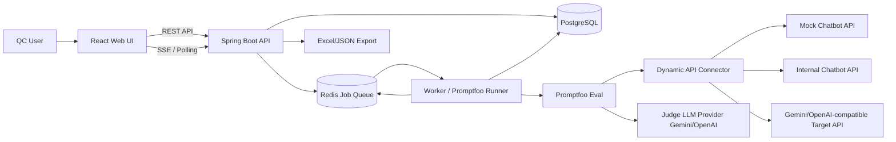
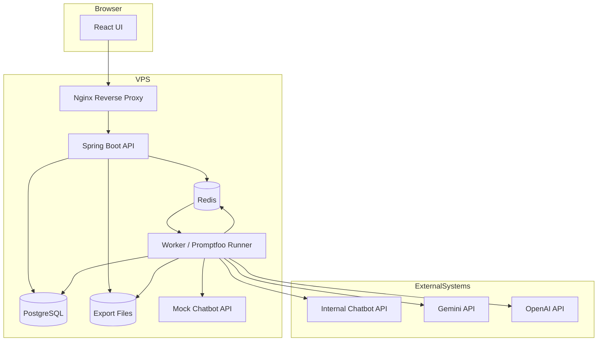
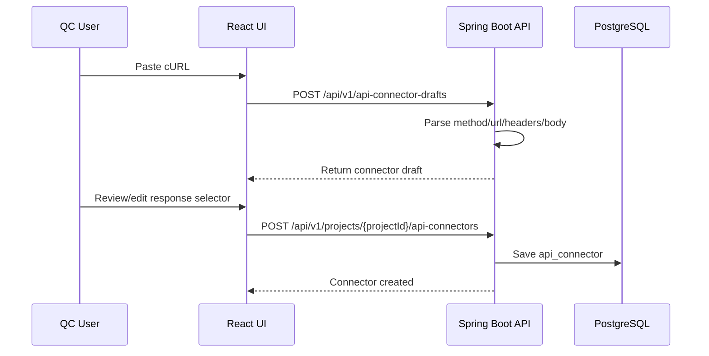
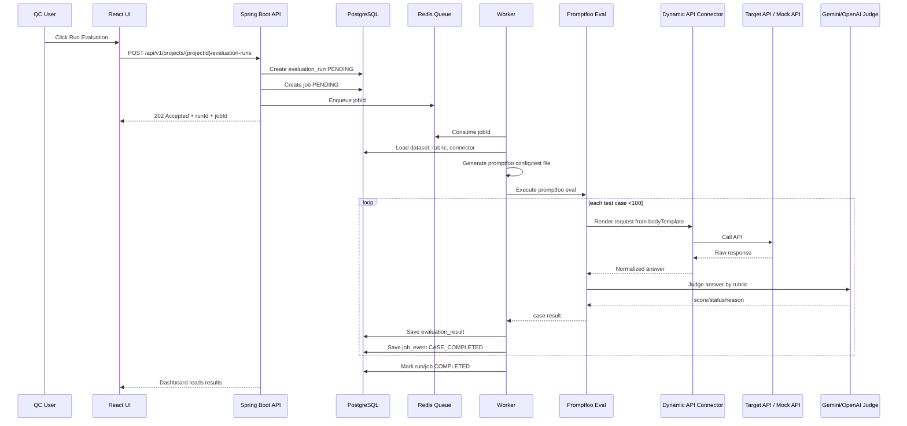
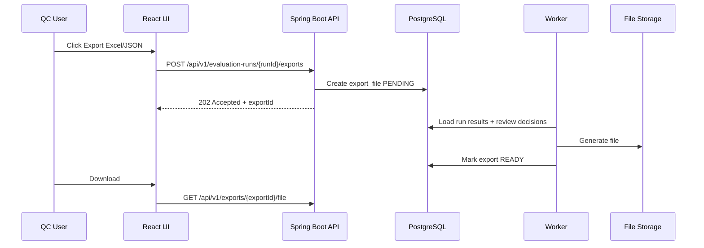

# 02. Architecture Design — VSF QC Copilot / Updated Architecture

## 1. Architecture Goal

VSF QC Copilot là web-based QC assistant platform dùng để evaluate internal hoặc external chatbot/LLM APIs.

Sau feedback mentor, kiến trúc cần tránh hard-code theo một chatbot cụ thể. Hệ thống phải support **Dynamic API Connector**, tức là sau này chỉ cần paste cURL hoặc nhập API config là có thể dùng để evaluation.

Promptfoo vẫn là evaluation engine bên dưới, nhưng platform sẽ quản lý:

```text
Project
API Connector
Dataset
Rubric
Evaluation Run
Result Dashboard
QC Review
Export
```

Core principle:

```text
Do not run long evaluation tasks directly inside HTTP requests.
Use REST API for command intake, PostgreSQL for source-of-truth state,
Redis-backed queue for async jobs, worker for execution, and dashboard/SSE/polling for progress.
```

## 2. Updated Architecture Summary

```text
React UI
→ Spring Boot REST API
→ PostgreSQL
→ Redis-backed Job Queue
→ Worker / Promptfoo Runner
→ Dynamic API Connector
→ Target Chatbot API / Mock Chatbot / Public LLM API
→ Judge LLM Provider Gemini/OpenAI
→ Results DB
→ Dashboard + Excel/JSON Export
```

## 3. Key Changes After Mentor Feedback

| Old assumption | Updated decision |
|---|---|
| 1 project = 1 chatbot cố định | 1 project = 1 evaluation scope |
| `chatbot_api_configs` fixed schema | `api_connectors` dynamic schema |
| Internal chatbot API available | May be unavailable, so add mock/demo chatbot API |
| Need 100–500+ cases | Demo target `<100` cases |
| Need company SSO | Simple username/password |
| Exact Excel template required | Follow current format, missing fields can be skipped |
| Streaming required | Optional/P2, MVP starts with non-streaming |

## 4. Technology Stack

| Layer | Technology | Notes |
|---|---|---|
| Frontend | React | QC workflow UI |
| Backend API | Spring Boot | REST API, auth, orchestration, export |
| Database | PostgreSQL | Durable source of truth |
| Job Queue | Redis | Queue/progress/pub-sub/lock for MVP |
| Worker | Spring Boot worker profile or separate worker | Runs promptfoo CLI and connector calls |
| Evaluation Engine | Promptfoo | Eval engine |
| Judge Provider | Gemini/OpenAI | LLM-as-Judge |
| Dataset Provider | Gemini/OpenAI | Dataset generation if enabled |
| Target API | Dynamic API Connector | Any chatbot-like API from cURL/config |
| Mock Target | Mock Chatbot API | Used when internal API is unavailable |
| Export | Apache POI / backend serializer | Excel + JSON |
| Deployment | Docker Compose on VPS | MVP-friendly |

## 5. High-level Architecture



## 6. Container Diagram



## 7. Main Components

### 7.1 React UI

Responsibilities:

```text
- Login
- Project list/detail
- API connector form
- Paste cURL screen
- Business requirement input
- Dataset table/edit/approve
- Rubric builder
- Evaluation run screen
- Result dashboard
- QC review/override
- Export buttons
```

### 7.2 Spring Boot API

Responsibilities:

```text
- Auth username/password
- REST API
- Validation
- Persist source-of-truth data
- Enqueue jobs
- Serve current job/run state
- Serve SSE if ready, polling fallback if not
- Serve export downloads
```

API should not directly run promptfoo for long jobs.

### 7.3 PostgreSQL

Source of truth for:

```text
users
projects
api_connectors
business_requirements
datasets
test_cases
rubrics
rubric_versions
rubric_criteria
jobs
job_events
evaluation_runs
evaluation_results
review_decisions
export_files
```

### 7.4 Redis-backed Job Queue

Used for:

```text
- pending job IDs
- progress cache if needed
- pub/sub progress event if SSE is implemented
- lightweight locks
```

Redis is not final storage.

### 7.5 Worker / Promptfoo Runner

Responsibilities:

```text
- Consume job
- Load job context from DB
- Generate promptfoo config/test file
- Execute promptfoo CLI
- Call target through Dynamic API Connector
- Call judge provider if needed
- Parse promptfoo JSON output
- Save normalized results
- Publish progress
- Generate export files
```

Recommended MVP implementation:

```text
Spring Boot API + Spring Boot Worker profile + local Node/promptfoo CLI
```

### 7.6 Dynamic API Connector

This is the new central integration piece.

Responsibilities:

```text
- Store raw cURL or manual API config
- Render body template with test case variables
- Inject headers/secrets safely
- Call target API
- Extract answer using response selector
- Normalize answer for promptfoo/judge
```

MVP supports:

```text
HTTP POST/GET
JSON body
Headers
Bearer/API key basic masking
Non-streaming JSON response
Response selector
Timeout/retry
```

Later supports:

```text
Streaming SSE/chunked response
multipart/form-data
complex auth
multiple connectors per project
```

### 7.7 Mock Chatbot API

Because API nội bộ có thể chưa available, MVP should include mock chatbot.

Purpose:

```text
- Không để project bị block
- Demo end-to-end flow
- Chủ động tạo PASS/FAIL/WARNING cases
- Test dashboard/export reliably
```

Example:

```http
POST /mock-chatbot/chat
```

Response:

```json
{
  "answer": "..."
}
```

### 7.8 Promptfoo Eval Engine

Promptfoo handles:

```text
- running test cases
- target/provider call
- assertions/metrics
- LLM-as-Judge
- JSON output
```

VSF QC Copilot handles:

```text
- config generation
- job management
- DB storage
- dashboard
- QC final review
- export
```

## 8. Core Flow — Create API Connector from cURL



Fallback:

```text
If cURL parsing is not good enough, user can manually input method/url/headers/body.
```

## 9. Core Flow — Evaluation Run



## 10. Core Flow — Export



Export rule:

```text
Theo format hiện tại. Field nào map được thì fill, field nào thiếu thì bỏ qua/để trống.
```

## 11. Updated Data Model

### 11.1 users

```text
id
username
password_hash
display_name
status
created_at
updated_at
last_login_at
```

### 11.2 projects

```text
id
name
description
evaluation_scope
retention_days
status
created_by
created_at
updated_at
archived_at
```

### 11.3 api_connectors

```text
id
project_id
name
description
raw_curl
method
url
headers_json_encrypted
query_params_json
body_template_json
auth_type
secret_refs_json
is_streaming
streaming_type
response_selector
response_format
timeout_seconds
retry_count
active
created_by
created_at
updated_at
```

Notes:

```text
- raw_curl stores original cURL for debugging/rebuild.
- headers_json_encrypted should not expose secrets.
- response_selector tells system where answer is in response JSON.
```

### 11.4 business_requirements

```text
id
project_id
content
version
status
created_by
created_at
updated_at
```

### 11.5 datasets

```text
id
project_id
requirement_id
version
source_type
status
created_by
created_at
updated_at
approved_by
approved_at
```

Possible source_type:

```text
GENERATED
IMPORTED_EXCEL
MANUAL
SAMPLE_DEMO
```

### 11.6 test_cases

```text
id
dataset_id
external_id
question
precondition
ground_truth
metadata_json
status
created_at
updated_at
```

### 11.7 rubrics / rubric_versions / rubric_criteria

```text
rubrics:
- id
- project_id
- name
- description
- current_version
- created_by
- created_at
- updated_at

rubric_versions:
- id
- rubric_id
- version
- status
- created_by
- created_at
- published_at

rubric_criteria:
- id
- rubric_version_id
- name
- description
- weight
- pass_condition
- fail_condition
- judge_instruction
- metric_key
- is_critical
- sort_order
- created_at
- updated_at
```

### 11.8 jobs / job_events

```text
jobs:
- id
- job_type
- status
- resource_type
- resource_id
- project_id
- created_by
- progress_current
- progress_total
- error_message
- retry_count
- max_retries
- created_at
- started_at
- completed_at
- updated_at

job_events:
- id
- job_id
- event_type
- payload_json
- created_at
```

Job types:

```text
DATASET_GENERATION
EVALUATION_RUN
EXPORT_EXCEL
EXPORT_JSON
CONNECTOR_TEST
```

### 11.9 evaluation_runs / evaluation_results

```text
evaluation_runs:
- id
- project_id
- dataset_id
- rubric_version_id
- api_connector_id
- job_id
- status
- total_cases
- passed_cases
- failed_cases
- warning_cases
- error_cases
- pass_rate
- started_at
- completed_at
- created_by
- created_at

evaluation_results:
- id
- evaluation_run_id
- test_case_id
- actual_answer
- raw_target_response_json
- judge_score
- judge_status
- judge_reason
- raw_promptfoo_result_json
- latency_ms
- token_usage_json
- created_at
```

### 11.10 review_decisions

```text
id
evaluation_result_id
qc_status
qc_note
pic_bug
reviewed_by
reviewed_at
updated_at
```

### 11.11 export_files

```text
id
project_id
evaluation_run_id
job_id
file_type
status
file_path
file_name
created_by
created_at
ready_at
```

## 12. RESTful API Design

Base path:

```text
/api/v1
```

### 12.1 Sessions

```http
POST   /api/v1/sessions
DELETE /api/v1/sessions/current
GET    /api/v1/users/me
```

### 12.2 Projects

```http
POST   /api/v1/projects
GET    /api/v1/projects
GET    /api/v1/projects/{projectId}
PATCH  /api/v1/projects/{projectId}
DELETE /api/v1/projects/{projectId}
```

### 12.3 API Connectors

```http
POST /api/v1/api-connector-drafts
POST /api/v1/projects/{projectId}/api-connectors
GET  /api/v1/projects/{projectId}/api-connectors
GET  /api/v1/api-connectors/{connectorId}
PATCH /api/v1/api-connectors/{connectorId}
```

Connector draft request:

```json
{
  "rawCurl": "curl -X POST https://example.com/chat -H 'Content-Type: application/json' -d '{\"message\":\"{{question}}\"}'"
}
```

Connector create request:

```json
{
  "name": "Demo Chatbot API",
  "method": "POST",
  "url": "https://example.com/chat",
  "headers": {
    "Content-Type": "application/json"
  },
  "bodyTemplate": {
    "message": "{{question}}",
    "context": "{{precondition}}"
  },
  "responseSelector": "$.answer",
  "isStreaming": false,
  "timeoutSeconds": 60,
  "retryCount": 1
}
```

Optional connector test:

```http
POST /api/v1/api-connectors/{connectorId}/test-runs
```

This is action-like, but acceptable as a subresource because it creates a test-run resource.

### 12.4 Requirements

```http
POST  /api/v1/projects/{projectId}/requirements
GET   /api/v1/projects/{projectId}/requirements
GET   /api/v1/requirements/{requirementId}
PATCH /api/v1/requirements/{requirementId}
```

### 12.5 Datasets

```http
POST  /api/v1/projects/{projectId}/datasets
GET   /api/v1/projects/{projectId}/datasets
GET   /api/v1/datasets/{datasetId}
PATCH /api/v1/datasets/{datasetId}
```

Dataset status update:

```json
{
  "status": "APPROVED"
}
```

Test cases:

```http
POST   /api/v1/datasets/{datasetId}/test-cases
GET    /api/v1/datasets/{datasetId}/test-cases
GET    /api/v1/test-cases/{testCaseId}
PATCH  /api/v1/test-cases/{testCaseId}
DELETE /api/v1/test-cases/{testCaseId}
```

### 12.6 Rubrics

```http
POST   /api/v1/projects/{projectId}/rubrics
GET    /api/v1/projects/{projectId}/rubrics
GET    /api/v1/rubrics/{rubricId}
PATCH  /api/v1/rubrics/{rubricId}
DELETE /api/v1/rubrics/{rubricId}
```

Rubric versions/criteria:

```http
POST  /api/v1/rubrics/{rubricId}/versions
GET   /api/v1/rubrics/{rubricId}/versions
GET   /api/v1/rubric-versions/{versionId}
PATCH /api/v1/rubric-versions/{versionId}

POST   /api/v1/rubric-versions/{versionId}/criteria
GET    /api/v1/rubric-versions/{versionId}/criteria
PATCH  /api/v1/rubric-criteria/{criteriaId}
DELETE /api/v1/rubric-criteria/{criteriaId}
```

### 12.7 Evaluation Runs

```http
POST /api/v1/projects/{projectId}/evaluation-runs
GET  /api/v1/projects/{projectId}/evaluation-runs
GET  /api/v1/evaluation-runs/{runId}
GET  /api/v1/evaluation-runs/{runId}/results
GET  /api/v1/evaluation-runs/{runId}/events
```

Create run:

```json
{
  "datasetId": "ds_001",
  "rubricVersionId": "rv_001",
  "apiConnectorId": "conn_001",
  "maxConcurrency": 3
}
```

MVP constraint:

```text
Validate total cases <100 or warn user if exceeded.
```

### 12.8 Review Decisions

```http
PUT   /api/v1/evaluation-results/{resultId}/review-decision
GET   /api/v1/evaluation-results/{resultId}/review-decision
PATCH /api/v1/review-decisions/{reviewDecisionId}
```

### 12.9 Exports

```http
POST /api/v1/evaluation-runs/{runId}/exports
GET  /api/v1/exports/{exportId}
GET  /api/v1/exports/{exportId}/file
```

Request:

```json
{
  "fileType": "EXCEL"
}
```

## 13. Promptfoo Integration Strategy

MVP strategy:

```text
Worker
→ Generate promptfoo config + test file
→ Execute promptfoo CLI
→ Output JSON
→ Parse JSON
→ Save normalized result into PostgreSQL
```

Why CLI wrapper first:

```text
- Faster for 2-week MVP
- Less risk than deep fork
- Easier to debug using previous PoC
- Platform stays independent from promptfoo internals
```

## 14. SSE and Polling

Preferred:

```text
SSE for real-time progress
```

Fallback:

```text
Polling GET /api/v1/jobs/{jobId} every 2–5 seconds
```

Reason:

```text
SSE is nice for UX, but MVP should not be blocked if SSE takes longer.
```

## 15. Security Considerations

Important because connector stores API details.

Rules:

```text
- Do not store tokens in plain text if possible
- Mask Authorization/API key in logs
- Mask secrets in raw_curl display
- Do not put secrets into promptfoo output saved in DB
- Avoid sending sensitive internal data to public LLM unless approved
```

## 16. Implementation Order

Recommended order for Week 3–4:

```text
1. Backend + DB + Redis skeleton
2. Simple auth
3. Project CRUD
4. API Connector manual form backend
5. Mock Chatbot API
6. Dataset CRUD/import/sample
7. Rubric CRUD
8. Evaluation run job skeleton
9. Worker consumes job
10. Promptfoo config generation
11. Promptfoo CLI run with mock connector
12. Save results
13. Dashboard UI
14. QC review/override
15. Export Excel/JSON
16. cURL parser if time
17. SSE/progress if time, polling fallback first
```

## 17. Summary

Updated architecture:

```text
VSF QC Copilot
= React UI
+ Spring Boot REST API
+ PostgreSQL
+ Redis-backed Job Queue
+ Worker / Promptfoo Runner
+ Dynamic API Connector from cURL/config
+ Mock/internal/public target API
+ Gemini/OpenAI judge
+ Dashboard
+ Excel/JSON export
```

Key point to report:

```text
The platform is no longer tied to one chatbot API schema. It can evaluate any chatbot-like API as long as we can configure the connector from cURL/body template/response selector.
```
