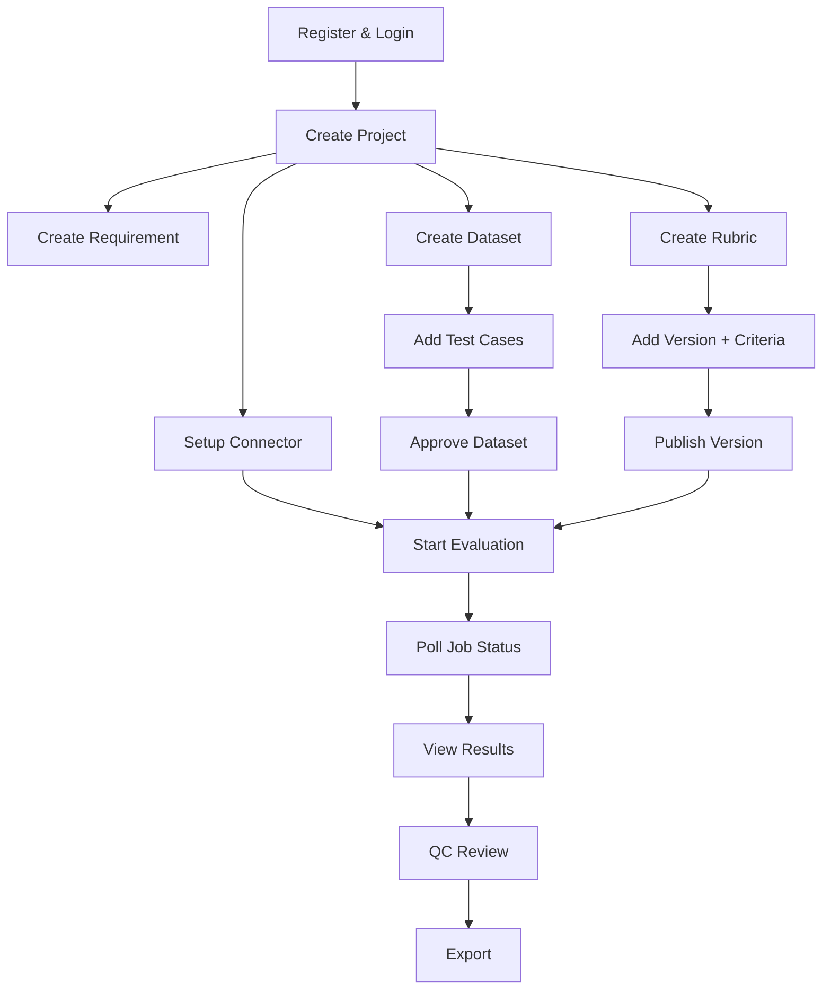

# VQC Copilot — Frontend API Reference

> **Version**: 2026-06-13 | **Base URL**: `http://localhost:8080` (dev)
>
> This document describes every API endpoint the frontend needs. All responses use `application/json` unless noted.

---

## Table of Contents

1. [Authentication & Session](#1-authentication--session)
2. [Projects](#2-projects)
3. [Target API Connectors](#3-target-api-connectors)
4. [Requirements](#4-requirements)
5. [Datasets](#5-datasets)
6. [Test Cases](#6-test-cases)
7. [Rubrics](#7-rubrics)
8. [Rubric Versions](#8-rubric-versions)
9. [Rubric Criteria](#9-rubric-criteria)
10. [Evaluation Runs](#10-evaluation-runs)
11. [Jobs](#11-jobs)
12. [Evaluation Results](#12-evaluation-results)
13. [QC Review Decisions](#13-qc-review-decisions)
14. [Export](#14-export)
15. [Error Handling](#15-error-handling)
16. [Enums Reference](#16-enums-reference)
17. [Pagination & Sorting](#17-pagination--sorting)
18. [Main Workflow](#18-main-workflow)
19. [Async Job Polling Pattern](#19-async-job-polling-pattern)

---

## Global Conventions

### Authentication

All endpoints under `/api/v1/*` (except `/api/v1/auth/*`) require:

```
Authorization: Bearer <access_token>
```

Access tokens expire. When you get a `401` with code `ACCESS_TOKEN_EXPIRED`, call `POST /api/v1/auth/refresh-token` (uses HttpOnly cookie). If refresh also fails, redirect to login.

### ID Format

All public-facing IDs are **UUID v4** strings (e.g., `"5cfb4c51-3ac4-44bd-93b4-8eb4e3f46f3a"`). Internal database IDs are never exposed.

### Timestamps

All timestamps are **ISO 8601 with timezone offset**: `"2026-06-13T10:30:00+07:00"`.

---

## 1. Authentication & Session

> Base path: `/api/v1/auth` — **No JWT required**

### POST /api/v1/auth/register

Create a new account. Sends email verification link.

**Request:**
```json
{
  "email": "qc@example.com",
  "password": "P@ssw0rd123",
  "fullName": "Nguyen Van A"
}
```

**Response:** `201 Created`
```json
{
  "message": "Registration successful. Please verify your email."
}
```

**Errors:** `VALIDATION_ERROR` (400), `EMAIL_ALREADY_EXISTS` (409)

---

### POST /api/v1/auth/login

**Request:**
```json
{
  "email": "qc@example.com",
  "password": "P@ssw0rd123"
}
```

**Response:** `200 OK`
```json
{
  "accessToken": "eyJhbGci...",
  "tokenType": "Bearer"
}
```

Also sets `refresh_token` as **HttpOnly Secure cookie** (not visible to JS).

**Errors:** `BAD_CREDENTIALS` (401), `ACCOUNT_LOCKED` (403), `EMAIL_NOT_VERIFIED` (403)

---

### POST /api/v1/auth/refresh-token

Reads `refresh_token` cookie automatically. No request body needed.

**Response:** `200 OK`
```json
{
  "accessToken": "eyJhbGci...",
  "tokenType": "Bearer"
}
```

Also rotates the `refresh_token` cookie.

**Errors:** `INVALID_REFRESH_TOKEN` (401), `REFRESH_TOKEN_EXPIRED` (401)

---

### POST /api/v1/auth/logout

Clears the `refresh_token` cookie.

**Response:** `204 No Content`

---

### POST /api/v1/auth/verify-email

**Request:**
```json
{
  "token": "<token-from-email-link>"
}
```

**Response:** `200 OK`

**Errors:** `INVALID_EMAIL_VERIFICATION_TOKEN` (400), `EMAIL_VERIFICATION_TOKEN_EXPIRED` (400), `EMAIL_VERIFICATION_TOKEN_USED` (400)

---

### POST /api/v1/auth/forgot-password

**Request:**
```json
{
  "email": "qc@example.com"
}
```

**Response:** `204 No Content` — Always returns 204 regardless of whether email exists (security).

---

### POST /api/v1/auth/reset-password

**Request:**
```json
{
  "token": "<token-from-email-link>",
  "newPassword": "NewP@ss123"
}
```

**Response:** `200 OK`

**Errors:** `INVALID_PASSWORD_RESET_TOKEN` (400), `PASSWORD_RESET_TOKEN_EXPIRED` (400), `PASSWORD_RESET_TOKEN_USED` (400)

---

### GET /api/v1/users/me *(auth required)*

**Response:** `200 OK`
```json
{
  "publicId": "uuid",
  "email": "qc@example.com",
  "fullName": "Nguyen Van A",
  "role": "QC_MEMBER",
  "status": "ACTIVE",
  "createdAt": "2026-06-13T10:30:00Z"
}
```

---

## 2. Projects

> All endpoints require authentication. Projects are owner-scoped.

### POST /api/v1/projects

**Request:**
```json
{
  "name": "Health Chatbot QC",
  "description": "QC evaluation for health chatbot v2"
}
```

| Field | Type | Required | Constraints |
|-------|------|----------|-------------|
| `name` | string | ✅ | 1–255 chars |
| `description` | string | ❌ | max 2000 chars |

**Response:** `201 Created` → `ProjectResponse`

---

### GET /api/v1/projects

List projects owned by authenticated user.

| Query Param | Type | Default | Description |
|-------------|------|---------|-------------|
| `status` | enum | all | `ACTIVE`, `ARCHIVED` |
| `page` | int | 0 | Zero-indexed page |
| `size` | int | 20 | Page size |
| `sort` | string | `createdAt,desc` | Sort field,direction |

**Response:** `200 OK` → `ProjectPageResponse`
```json
{
  "items": [ProjectListItemResponse],
  "page": 0,
  "size": 20,
  "totalItems": 42,
  "totalPages": 3
}
```

---

### GET /api/v1/projects/{projectPublicId}

**Response:** `200 OK` → `ProjectResponse`
```json
{
  "publicId": "uuid",
  "name": "Health Chatbot QC",
  "description": "...",
  "status": "ACTIVE",
  "creator": {
    "publicId": "uuid",
    "email": "qc@example.com",
    "fullName": "Nguyen Van A"
  },
  "createdAt": "2026-06-13T10:30:00Z",
  "updatedAt": "2026-06-13T10:30:00Z",
  "archivedAt": null
}
```

**Errors:** `PROJECT_NOT_FOUND` (404)

---

### PATCH /api/v1/projects/{projectPublicId}

Partial update. Send only fields you want to change.

**Request:**
```json
{
  "name": "Updated Name",
  "description": "Updated description"
}
```

**Response:** `200 OK` → `ProjectResponse`

---

### DELETE /api/v1/projects/{projectPublicId}

Soft archive. Sets status to `ARCHIVED`.

**Response:** `204 No Content`

---

## 3. Target API Connectors

> Connectors define how to call the chatbot being evaluated.

### POST /api/v1/projects/{projectPublicId}/target-api-connectors

**Request:**
```json
{
  "name": "Production Health Bot",
  "method": "POST",
  "url": "https://api.example.com/chat",
  "headers": {
    "Content-Type": "application/json",
    "Authorization": "Bearer {{secret:API_TOKEN}}"
  },
  "bodyTemplate": {
    "question": "{{question}}"
  },
  "responseSelector": "$.answer",
  "secretValues": {
    "API_TOKEN": "sk-real-secret-value"
  }
}
```

| Field | Type | Required | Notes |
|-------|------|----------|-------|
| `name` | string | ✅ | 1–255 chars |
| `method` | enum | ✅ | `GET`, `POST`, `PUT`, `PATCH` |
| `url` | string | ✅ | Full URL |
| `headers` | object | ❌ | Use `{{secret:KEY}}` for secrets |
| `bodyTemplate` | object | ❌ | Use `{{question}}` placeholder |
| `responseSelector` | string | ✅ | `$.answer` or `$.data.answer` |
| `secretValues` | object | ❌ | **Write-only**, never returned |

**Response:** `201 Created` → `TargetApiConnectorResponse`

> ⚠️ `secretValues` are encrypted server-side. Responses return `secretRefs` (masked references), never raw values.

---

### GET /api/v1/projects/{projectPublicId}/target-api-connectors

**Response:** `200 OK` → `TargetApiConnectorPageResponse`

---

### GET /api/v1/target-api-connectors/{connectorPublicId}

**Response:** `200 OK` → `TargetApiConnectorResponse`

---

### PATCH /api/v1/target-api-connectors/{connectorPublicId}

Partial update. Same fields as create (all optional).

---

### POST /api/v1/target-api-connectors/{connectorPublicId}/test-runs

Test the connector with a sample request.

**Request:**
```json
{
  "question": "What is diabetes?",
  "precondition": "User is asking about health"
}
```

**Response:** `200 OK`
```json
{
  "statusCode": 200,
  "responseBody": { "answer": "Diabetes is..." },
  "latencyMs": 450
}
```

---

## 4. Requirements

### POST /api/v1/projects/{projectPublicId}/requirements

**Request:**
```json
{
  "content": "The chatbot must provide accurate medical information with citations."
}
```

**Response:** `201 Created` → `RequirementResponse`

---

### GET /api/v1/projects/{projectPublicId}/requirements

| Query Param | Type | Default |
|-------------|------|---------|
| `status` | enum | all (`ACTIVE`, `ARCHIVED`) |

**Response:** `200 OK` → `RequirementPageResponse`

---

### GET /api/v1/requirements/{requirementPublicId}

**Response:** `200 OK` → `RequirementResponse`
```json
{
  "publicId": "uuid",
  "projectPublicId": "uuid",
  "content": "...",
  "version": 1,
  "status": "ACTIVE",
  "createdAt": "...",
  "updatedAt": "..."
}
```

---

### PATCH /api/v1/requirements/{requirementPublicId}

**Request:**
```json
{
  "content": "Updated requirement text",
  "status": "ARCHIVED"
}
```

> `version` auto-increments only when `content` changes.

---

## 5. Datasets

### POST /api/v1/projects/{projectPublicId}/datasets

**Request:**
```json
{
  "name": "Health QA Dataset v1",
  "description": "50 health questions",
  "requirementPublicId": "uuid-optional",
  "generationPrompt": "Optional context for AI generation"
}
```

**Response:** `201 Created` → `DatasetResponse`

---

### GET /api/v1/projects/{projectPublicId}/datasets

| Query Param | Type | Default |
|-------------|------|---------|
| `status` | enum | all (`DRAFT`, `APPROVED`, `ARCHIVED`) |

---

### GET /api/v1/datasets/{datasetPublicId}

**Response:** `200 OK` → `DatasetResponse`

---

### PATCH /api/v1/datasets/{datasetPublicId}

**Request (approve example):**
```json
{
  "status": "APPROVED"
}
```

> Approving requires 1–100 active test cases. Archived datasets cannot be modified.

**Errors:** `DATASET_APPROVAL_INVALID` (422), `DATASET_ARCHIVED` (409)

---

### POST /api/v1/datasets/{datasetPublicId}/test-cases/import

Bulk import test cases from Excel/CSV.

**Request:** `multipart/form-data`
| Part | Type | Required |
|------|------|----------|
| `file` | `.xlsx` or `.csv` | ✅ |

**Response:** `200 OK`
```json
{
  "totalRows": 25,
  "importedCount": 23,
  "skippedCount": 2,
  "errors": [
    { "row": 5, "field": "question", "message": "Question is required." },
    { "row": 12, "field": "question", "message": "Duplicate question." }
  ]
}
```

**Errors:** `IMPORT_FILE_EMPTY` (400), `IMPORT_FILE_TOO_LARGE` (400), `IMPORT_FILE_INVALID_FORMAT` (400), `IMPORT_TOO_MANY_ROWS` (422)

---

### POST /api/v1/datasets/{datasetPublicId}/generate

AI-generate test cases using Gemini. Async operation.

**Request:**
```json
{
  "requirementPublicId": "uuid",
  "count": 20,
  "additionalPrompt": "Focus on edge cases for diabetes questions"
}
```

| Field | Type | Required | Constraints |
|-------|------|----------|-------------|
| `requirementPublicId` | UUID | ✅ | Must reference an ACTIVE requirement |
| `count` | int | ✅ | 5–100 |
| `additionalPrompt` | string | ❌ | Extra context for AI |

**Response:** `202 Accepted`
```json
{
  "jobPublicId": "uuid"
}
```

Poll `GET /api/v1/jobs/{jobPublicId}` for completion.

---

## 6. Test Cases

### POST /api/v1/datasets/{datasetPublicId}/test-cases

**Request:**
```json
{
  "question": "What are the symptoms of diabetes?",
  "groundTruth": "Common symptoms include...",
  "precondition": "User has no prior medical knowledge",
  "metadata": { "category": "diabetes", "difficulty": "easy" }
}
```

| Field | Type | Required | Constraints |
|-------|------|----------|-------------|
| `question` | string | ✅ | 1–8000 chars |
| `groundTruth` | string | ❌ | max 8000 chars |
| `precondition` | string | ❌ | max 4000 chars |
| `metadata` | object | ❌ | Free-form JSON |

**Response:** `201 Created` → `TestCaseResponse`

---

### GET /api/v1/datasets/{datasetPublicId}/test-cases

| Query Param | Type | Default |
|-------------|------|---------|
| `status` | enum | all (`ACTIVE`, `INACTIVE`) |

**Response:** `200 OK` → `TestCasePageResponse`

---

### PATCH /api/v1/test-cases/{testCasePublicId}

Partial update. Same fields as create, all optional. Plus `status`.

---

### DELETE /api/v1/test-cases/{testCasePublicId}

**Hard delete.** Not a soft archive.

**Response:** `204 No Content`

---

## 7. Rubrics

> Rubrics are **user-scoped** (not project-scoped). A rubric can be linked to a project or exist independently.

### POST /api/v1/projects/{projectPublicId}/rubrics

Create rubric linked to a project.

**Request:**
```json
{
  "name": "Health Answer Quality Rubric",
  "description": "Evaluates correctness and safety"
}
```

**Response:** `201 Created` → `RubricResponse`

---

### GET /api/v1/projects/{projectPublicId}/rubrics

List rubrics under a specific project.

---

### GET /api/v1/rubrics

List **all rubrics** owned by the authenticated user (cross-project).

| Query Param | Type | Default |
|-------------|------|---------|
| `status` | enum | all (`ACTIVE`, `ARCHIVED`) |

---

### GET /api/v1/rubrics/templates

List system-provided rubric templates (read-only).

**Response:** `200 OK` → `RubricPageResponse`

---

### POST /api/v1/rubrics/{rubricPublicId}/clone

Create a personal copy of a rubric (works for templates and other users' shared rubrics).

**Response:** `201 Created` → `RubricResponse`

---

### GET /api/v1/rubrics/{rubricPublicId}

**Response:** `200 OK` → `RubricResponse`
```json
{
  "publicId": "uuid",
  "projectPublicId": "uuid-or-null",
  "name": "Health Answer Quality Rubric",
  "description": "...",
  "currentVersion": 2,
  "status": "ACTIVE",
  "createdAt": "...",
  "updatedAt": "...",
  "archivedAt": null
}
```

---

### PATCH /api/v1/rubrics/{rubricPublicId}

### DELETE /api/v1/rubrics/{rubricPublicId}

Soft archive. Sets status to `ARCHIVED`.

---

## 8. Rubric Versions

### POST /api/v1/rubrics/{rubricPublicId}/versions

Creates a new DRAFT version. Version number auto-increments.

**Response:** `201 Created` → `RubricVersionResponse`

---

### GET /api/v1/rubrics/{rubricPublicId}/versions

| Query Param | Type | Default |
|-------------|------|---------|
| `status` | enum | all (`DRAFT`, `PUBLISHED`, `ARCHIVED`) |

---

### GET /api/v1/rubric-versions/{rubricVersionPublicId}

**Response:** `200 OK` → `RubricVersionResponse`
```json
{
  "publicId": "uuid",
  "rubricPublicId": "uuid",
  "version": 2,
  "status": "DRAFT",
  "createdAt": "...",
  "publishedAt": null,
  "criteria": [RubricCriterionResponse]
}
```

---

### PATCH /api/v1/rubric-versions/{rubricVersionPublicId}

Publish or archive a version.

**Request (publish):**
```json
{
  "status": "PUBLISHED"
}
```

**Publish requirements:**
- Must be in `DRAFT` status
- Must have **at least 1 criterion**
- No weight sum constraint (system normalizes automatically)

**Request (archive):**
```json
{
  "status": "ARCHIVED"
}
```

**Errors:** `RUBRIC_VERSION_IMMUTABLE` (409), `RUBRIC_VERSION_PUBLISH_INVALID` (422)

---

## 9. Rubric Criteria

### POST /api/v1/rubric-versions/{rubricVersionPublicId}/criteria

**Request:**
```json
{
  "name": "Correctness",
  "description": "Evaluates factual accuracy of the answer",
  "weight": 3,
  "passCondition": "Answer matches ground truth facts",
  "failCondition": "Answer contains factual errors",
  "judgeInstruction": "Compare the actual answer with the ground truth. Check each claim for accuracy.",
  "metricKey": "correctness",
  "isCritical": true,
  "sortOrder": 1
}
```

| Field | Type | Required | Constraints |
|-------|------|----------|-------------|
| `name` | string | ✅ | 1–255 chars |
| `description` | string | ❌ | max 2000 chars |
| `weight` | integer | ❌ | 1–100, default `1`. **Relative importance** — system normalizes via `Σ(w×s)/Σ(w)` |
| `passCondition` | string | ❌ | max 4000 chars |
| `failCondition` | string | ❌ | max 4000 chars |
| `judgeInstruction` | string | ✅ | 1–8000 chars. Prompt for the AI judge. |
| `metricKey` | string | ✅ | 1–100 chars. `^[a-z][a-z0-9_]*$`. **Unique per version.** |
| `isCritical` | boolean | ❌ | If `true`, failing this criterion forces overall `FAIL` regardless of score |
| `sortOrder` | integer | ❌ | Display order, default `0` |

> **Weight system:** Use integers to express relative importance.
> Example: `correctness=3, tone=2, safety=5` → system computes `3/10=30%, 2/10=20%, 5/10=50%`.

**Response:** `201 Created` → `RubricCriterionResponse`
```json
{
  "publicId": "uuid",
  "rubricVersionPublicId": "uuid",
  "name": "Correctness",
  "description": "...",
  "weight": 3,
  "passCondition": "...",
  "failCondition": "...",
  "judgeInstruction": "...",
  "metricKey": "correctness",
  "isCritical": true,
  "sortOrder": 1,
  "createdAt": "...",
  "updatedAt": "..."
}
```

**Errors:** `RUBRIC_CRITERION_METRIC_KEY_CONFLICT` (409), `RUBRIC_VERSION_IMMUTABLE` (409)

---

### GET /api/v1/rubric-versions/{rubricVersionPublicId}/criteria

**Response:** `200 OK` → `RubricCriterionPageResponse`

---

### PATCH /api/v1/rubric-criteria/{criterionPublicId}

Partial update. All fields optional.

---

### DELETE /api/v1/rubric-criteria/{criterionPublicId}

**Response:** `204 No Content`

Only allowed on `DRAFT` versions. **Errors:** `RUBRIC_VERSION_IMMUTABLE` (409)

---

## 10. Evaluation Runs

### POST /api/v1/projects/{projectPublicId}/evaluation-runs

Start an evaluation. This is an **async operation**.

**Request:**
```json
{
  "datasetPublicId": "uuid",
  "rubricVersionPublicId": "uuid",
  "connectorPublicId": "uuid"
}
```

**Pre-conditions (validated server-side):**
- Dataset must be `APPROVED` with 1–100 active test cases
- Rubric version must be `PUBLISHED`
- Connector must exist and be active

**Response:** `202 Accepted`
```json
{
  "runPublicId": "uuid",
  "jobPublicId": "uuid"
}
```

**Errors:** `DATASET_NOT_APPROVED` (422), `DATASET_NO_ACTIVE_CASES` (422), `DATASET_TOO_MANY_CASES` (422), `RUBRIC_VERSION_NOT_PUBLISHED` (422), `CONNECTOR_NOT_ACTIVE` (422)

---

### POST /api/v1/projects/{projectPublicId}/quick-evaluate

Quick start with auto-resolve. Any `null` field is auto-resolved to the **sole candidate** for that project.

**Request:**
```json
{
  "datasetPublicId": null,
  "rubricVersionPublicId": null,
  "connectorPublicId": null
}
```

**Response:** `202 Accepted` → same as `CreateEvaluationRunResponse`

**Errors:** `QUICK_EVALUATE_AMBIGUOUS` (422) — when 0 or >1 candidates exist for an auto-resolved field.

---

### GET /api/v1/projects/{projectPublicId}/evaluation-runs

**Response:** `200 OK` → `EvaluationRunPageResponse`

---

### GET /api/v1/evaluation-runs/{runPublicId}

**Response:** `200 OK` → `EvaluationRunDetailResponse`
```json
{
  "publicId": "uuid",
  "projectPublicId": "uuid",
  "datasetPublicId": "uuid",
  "rubricVersionPublicId": "uuid",
  "connectorPublicId": "uuid",
  "status": "COMPLETED",
  "totalCases": 25,
  "completedCases": 25,
  "passCount": 20,
  "failCount": 3,
  "warningCount": 2,
  "errorCount": 0,
  "createdAt": "...",
  "completedAt": "..."
}
```

---

### GET /api/v1/evaluation-runs/{runPublicId}/results

| Query Param | Type | Default |
|-------------|------|---------|
| `judgeStatus` | enum | all (`PASS`, `FAIL`, `WARNING`, `ERROR`) |
| `qcStatus` | enum | all (`NOT_REVIEWED`, `PASS`, `FAIL`, `NEED_FIX`, `IGNORED`) |

**Response:** `200 OK` → `EvaluationResultPageResponse`
```json
{
  "items": [
    {
      "publicId": "uuid",
      "testCasePublicId": "uuid",
      "question": "What is diabetes?",
      "groundTruth": "Diabetes is a chronic...",
      "actualAnswer": "Diabetes is a condition...",
      "judgeScore": 0.8500,
      "judgeStatus": "PASS",
      "judgeReason": "Answer is mostly accurate",
      "criteriaResultsJson": "[{\"metricKey\":\"correctness\",\"pass\":true,\"score\":0.9}]",
      "latencyMs": 450,
      "qcStatus": "NOT_REVIEWED",
      "qcNote": null,
      "picBug": null,
      "createdAt": "..."
    }
  ],
  "page": 0,
  "size": 20,
  "totalItems": 25,
  "totalPages": 2
}
```

---

### GET /api/v1/evaluation-runs/{runPublicId}/events

**Response:** `200 OK`
```json
[
  {
    "publicId": "uuid",
    "eventType": "RUNNING",
    "message": "Evaluation started",
    "createdAt": "..."
  },
  {
    "publicId": "uuid",
    "eventType": "CASE_COMPLETED",
    "message": "Completed 5/25 test cases",
    "createdAt": "..."
  }
]
```

---

## 11. Jobs

### GET /api/v1/jobs/{jobPublicId}

Poll job status for any async operation (evaluation, export, AI generation).

**Response:** `200 OK`
```json
{
  "publicId": "uuid",
  "jobType": "EVALUATION",
  "status": "RUNNING",
  "resourcePublicId": "uuid",
  "progress": 60,
  "message": "Completed 15/25 test cases",
  "createdAt": "...",
  "completedAt": null
}
```

| `status` | Meaning |
|----------|---------|
| `PENDING` | Queued, not started |
| `RUNNING` | In progress |
| `COMPLETED` | Finished successfully |
| `FAILED` | Finished with error |
| `CANCELLED` | Cancelled |

---

## 12. Evaluation Results

Results are read-only. Created by the evaluation worker.

See `GET /api/v1/evaluation-runs/{runPublicId}/results` in Section 10.

---

## 13. QC Review Decisions

### PUT /api/v1/evaluation-results/{resultPublicId}/review-decision

Upsert (create or replace) a QC review decision.

**Request:**
```json
{
  "qcStatus": "FAIL",
  "qcNote": "Answer is factually incorrect about insulin dosage",
  "picBugUserPublicId": "uuid-optional"
}
```

| Field | Type | Required | Notes |
|-------|------|----------|-------|
| `qcStatus` | enum | ✅ | `PASS`, `FAIL`, `NEED_FIX`, `IGNORED` |
| `qcNote` | string | ❌ | Free-text QC comment |
| `picBugUserPublicId` | UUID | ❌ | Assign a PIC for bugs |

**Response:** `200 OK` → `ReviewDecisionResponse`

**Errors:** `REVIEW_DECISION_STATUS_INVALID` (400) — `NOT_REVIEWED` is read-only, cannot be set.

---

### GET /api/v1/evaluation-results/{resultPublicId}/review-decision

**Response:** `200 OK` → `ReviewDecisionResponse`

Returns `qcStatus: "NOT_REVIEWED"` when no review exists yet (no 404).

```json
{
  "publicId": "uuid-or-null",
  "resultPublicId": "uuid",
  "qcStatus": "NOT_REVIEWED",
  "qcNote": null,
  "reviewedBy": null,
  "picBug": null,
  "createdAt": null,
  "updatedAt": null
}
```

---

### PATCH /api/v1/review-decisions/{reviewDecisionPublicId}

Update an existing review decision.

**Request:**
```json
{
  "qcStatus": "NEED_FIX",
  "qcNote": "Updated note"
}
```

---

## 14. Export

### POST /api/v1/evaluation-runs/{runPublicId}/exports

Create an async export job.

**Request:**
```json
{
  "format": "EXCEL"
}
```

| `format` | Output |
|----------|--------|
| `EXCEL` | `.xlsx` file |
| `JSON` | `.json` file |

**Response:** `202 Accepted`
```json
{
  "exportPublicId": "uuid",
  "jobPublicId": "uuid"
}
```

---

### GET /api/v1/exports/{exportPublicId}

**Response:** `200 OK`
```json
{
  "publicId": "uuid",
  "status": "READY",
  "format": "EXCEL",
  "fileName": "evaluation-results-2026-06-13.xlsx",
  "sizeBytes": 15420,
  "downloadUrl": "/api/v1/exports/{exportPublicId}/file",
  "createdAt": "..."
}
```

| `status` | Meaning |
|----------|---------|
| `PENDING` | Job queued |
| `READY` | File available for download |
| `FAILED` | Generation failed |

---

### GET /api/v1/exports/{exportPublicId}/file

Download the export file. Returns binary content with appropriate `Content-Type`.

**Response:** `200 OK` — binary file download

**Errors:** `EXPORT_FILE_NOT_READY` (409), `EXPORT_FILE_NOT_FOUND` (404)

---

## 15. Error Handling

All errors follow **RFC 9457 Problem Details** format:

```json
{
  "message": "Human-readable error message",
  "status": 422,
  "code": "DATASET_NOT_APPROVED",
  "instance": "/api/v1/projects/uuid/evaluation-runs"
}
```

### Validation Errors (400)

```json
{
  "message": "Validation failed for input data.",
  "status": 400,
  "code": "VALIDATION_ERROR",
  "errors": [
    {
      "field": "name",
      "message": "Criterion name is required."
    },
    {
      "field": "weight",
      "message": "Criterion weight must be at least 1."
    }
  ]
}
```

### Complete Error Code Reference

| Code | HTTP | Description |
|------|------|-------------|
| **Auth** | | |
| `UNAUTHORIZED` | 401 | No valid JWT |
| `BAD_CREDENTIALS` | 401 | Wrong email/password |
| `ACCESS_TOKEN_EXPIRED` | 401 | JWT expired → refresh |
| `INVALID_ACCESS_TOKEN` | 401 | Malformed JWT |
| `INVALID_REFRESH_TOKEN` | 401 | Bad refresh cookie |
| `REFRESH_TOKEN_EXPIRED` | 401 | Refresh cookie expired → re-login |
| `ACCESS_DENIED` | 403 | Insufficient permissions |
| `ACCOUNT_LOCKED` | 403 | Account disabled |
| `EMAIL_NOT_VERIFIED` | 403 | Must verify email first |
| **Validation** | | |
| `VALIDATION_ERROR` | 400 | Field validation failed (see `errors[]`) |
| `MISSING_PARAMETER` | 400 | Required query/path param missing |
| `HTTP_MESSAGE_NOT_READABLE` | 400 | Malformed JSON |
| **Not Found** | | |
| `PROJECT_NOT_FOUND` | 404 | |
| `DATASET_NOT_FOUND` | 404 | |
| `TEST_CASE_NOT_FOUND` | 404 | |
| `RUBRIC_NOT_FOUND` | 404 | |
| `RUBRIC_VERSION_NOT_FOUND` | 404 | |
| `RUBRIC_CRITERION_NOT_FOUND` | 404 | |
| `REQUIREMENT_NOT_FOUND` | 404 | |
| `TARGET_CONNECTOR_NOT_FOUND` | 404 | |
| `EVALUATION_RUN_NOT_FOUND` | 404 | |
| `EVALUATION_RESULT_NOT_FOUND` | 404 | |
| `JOB_NOT_FOUND` | 404 | |
| `REVIEW_DECISION_NOT_FOUND` | 404 | |
| `EXPORT_FILE_NOT_FOUND` | 404 | |
| **Conflict** | | |
| `EMAIL_ALREADY_EXISTS` | 409 | |
| `DATASET_ARCHIVED` | 409 | Cannot modify archived dataset |
| `RUBRIC_ARCHIVED` | 409 | Cannot modify archived rubric |
| `RUBRIC_VERSION_IMMUTABLE` | 409 | Published/archived version is read-only |
| `RUBRIC_CRITERION_METRIC_KEY_CONFLICT` | 409 | Duplicate metricKey in version |
| `EXPORT_FILE_NOT_READY` | 409 | Export not yet generated |
| **Business Validation** | | |
| `DATASET_APPROVAL_INVALID` | 422 | Need 1–100 active test cases |
| `DATASET_NOT_APPROVED` | 422 | Must approve before evaluation |
| `DATASET_NO_ACTIVE_CASES` | 422 | No active test cases |
| `DATASET_TOO_MANY_CASES` | 422 | Exceeds 100 active cases |
| `RUBRIC_VERSION_NOT_PUBLISHED` | 422 | Must publish before evaluation |
| `RUBRIC_VERSION_PUBLISH_INVALID` | 422 | Need ≥1 criterion to publish |
| `CONNECTOR_NOT_ACTIVE` | 422 | Connector inactive |
| `QUICK_EVALUATE_AMBIGUOUS` | 422 | Auto-resolve found 0 or >1 candidates |
| `REVIEW_DECISION_STATUS_INVALID` | 400 | `NOT_REVIEWED` is read-only |
| **Import** | | |
| `IMPORT_FILE_EMPTY` | 400 | No data rows |
| `IMPORT_FILE_TOO_LARGE` | 400 | Exceeds 5 MB |
| `IMPORT_FILE_INVALID_FORMAT` | 400 | Not .xlsx or .csv |
| `IMPORT_TOO_MANY_ROWS` | 422 | Would exceed 100 test cases |
| **Infrastructure** | | |
| `RATE_LIMIT_EXCEEDED` | 429 | Too many requests |
| `INTERNAL_SERVER_ERROR` | 500 | Unexpected server error |

---

## 16. Enums Reference

| Enum | Values |
|------|--------|
| `ProjectStatus` | `ACTIVE`, `ARCHIVED` |
| `DatasetStatus` | `DRAFT`, `APPROVED`, `ARCHIVED` |
| `TestCaseStatus` | `ACTIVE`, `INACTIVE` |
| `RubricStatus` | `ACTIVE`, `ARCHIVED` |
| `RubricVersionStatus` | `DRAFT`, `PUBLISHED`, `ARCHIVED` |
| `EvaluationRunStatus` | `PENDING`, `RUNNING`, `COMPLETED`, `FAILED`, `CANCELLED` |
| `JobStatus` | `PENDING`, `RUNNING`, `COMPLETED`, `FAILED`, `CANCELLED` |
| `JudgeStatus` | `PASS`, `FAIL`, `WARNING`, `ERROR` |
| `QcStatus` | `NOT_REVIEWED`, `PASS`, `FAIL`, `NEED_FIX`, `IGNORED` |
| `QcStatus` (writable) | `PASS`, `FAIL`, `NEED_FIX`, `IGNORED` |
| `ExportFormat` | `EXCEL`, `JSON` |
| `ExportStatus` | `PENDING`, `READY`, `FAILED` |
| `HttpMethodType` | `GET`, `POST`, `PUT`, `PATCH` |
| `RequirementStatus` | `ACTIVE`, `ARCHIVED` |
| `Role` | `QC_MEMBER`, `QC_LEAD`, `ADMIN` |

---

## 17. Pagination & Sorting

All list endpoints support Spring Data pagination:

| Param | Type | Default | Description |
|-------|------|---------|-------------|
| `page` | int | `0` | Zero-indexed page number |
| `size` | int | `20` | Items per page (max varies) |
| `sort` | string | `createdAt,desc` | `fieldName,asc` or `fieldName,desc` |

**Response shape:**
```json
{
  "items": [...],
  "page": 0,
  "size": 20,
  "totalItems": 42,
  "totalPages": 3
}
```

---

## 18. Main Workflow

```
1. Register → Verify Email → Login
2. Create Project
3. Create Target API Connector → Test Run
4. Create Requirement (optional)
5. Create Dataset → Add/Import Test Cases → Approve Dataset
6. Create Rubric → Create Version → Add Criteria → Publish Version
7. Start Evaluation Run (202) → Poll Job → View Results
8. QC Review each result → Export results
```



---

## 19. Async Job Polling Pattern

Three operations are async and return `202 Accepted` with a `jobPublicId`:

1. **Evaluation Run** — `POST /projects/{id}/evaluation-runs`
2. **Export** — `POST /evaluation-runs/{id}/exports`
3. **AI Generate** — `POST /datasets/{id}/generate`

### Polling Flow

```
1. POST → 202 { jobPublicId: "uuid" }
2. Poll: GET /api/v1/jobs/{jobPublicId}
3. While status is PENDING or RUNNING → wait 2-3s → repeat
4. When COMPLETED → use resourcePublicId to fetch result
5. When FAILED → show error message
```

### Recommended Polling Strategy

```javascript
async function pollJob(jobPublicId) {
  const POLL_INTERVAL = 3000; // 3 seconds
  const MAX_POLLS = 60;       // 3 minutes max

  for (let i = 0; i < MAX_POLLS; i++) {
    const res = await fetch(`/api/v1/jobs/${jobPublicId}`, {
      headers: { Authorization: `Bearer ${token}` }
    });
    const job = await res.json();

    if (job.status === 'COMPLETED') return job;
    if (job.status === 'FAILED') throw new Error(job.message);
    if (job.status === 'CANCELLED') throw new Error('Job cancelled');

    await new Promise(r => setTimeout(r, POLL_INTERVAL));
  }
  throw new Error('Job polling timeout');
}
```
