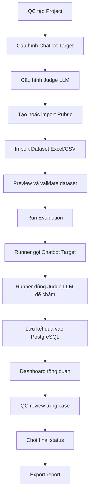

# Product Requirement Document

## Dự án: Nền tảng nội bộ QC chatbot AI

### Phiên bản tài liệu

| Thuộc tính | Nội dung |
|---|---|
| Tên tài liệu | Product Requirement Document |
| Phạm vi | MVP nội bộ cho QC và tester |
| Ngôn ngữ | Tiếng Việt |
| Trạng thái | Bản khởi tạo để thảo luận với mentor và team QC |
| Đầu vào chính | Mô tả workflow hiện tại, file Excel kết quả QC, định hướng sử dụng Promptfoo làm eval engine |

---

## 1. Bối cảnh

Team QC/tester hiện đang đánh giá chatbot AI nội bộ bằng quy trình nhiều bước thủ công. QC phải đọc business requirement, tạo hoặc lấy mock data, query DB, sử dụng chatbot/AI bên ngoài để sinh test case và ground truth, chỉnh sửa lại ground truth, đưa dữ liệu vào Excel, chạy tool gọi chatbot nội bộ, dùng LLM khác để chấm, sau đó QC vẫn phải review từng dòng trong file Excel để chốt kết quả.

Quy trình hiện tại có các vấn đề chính:

| Nhóm vấn đề | Mô tả |
|---|---|
| Phân tán công cụ | QC phải di chuyển giữa nhiều tool, chatbot bên ngoài, Excel và tool nội bộ. |
| Khó chuẩn hóa | Rubric, prompt chấm, format dataset và cách chốt Pass/Fail chưa được quản lý tập trung. |
| Khó kiểm soát kết quả | Kết quả nằm trong Excel, khó dashboard, khó filter, khó audit, khó so sánh giữa các lần chạy. |
| Phụ thuộc thao tác thủ công | QC vẫn phải nhìn từng dòng Excel để review và chốt kết quả. |
| Khó mở rộng theo nhiều chatbot | Mỗi chatbot có request/response API khác nhau, dẫn tới tool hiện tại khó tổng quát hóa. |

---

## 2. Mục tiêu sản phẩm

Xây dựng một nền tảng nội bộ cho team QC/tester sử dụng để đánh giá chatbot AI nội bộ theo luồng end-to-end, từ quản lý dataset, cấu hình chatbot cần chấm, cấu hình LLM judge, cấu hình rubric, chạy evaluation, xem dashboard, review kết quả, đến export báo cáo.

Mục tiêu MVP là chứng minh được luồng chính:

```text
Import dataset từ Excel/CSV
→ Cấu hình chatbot target API
→ Cấu hình LLM judge và rubric
→ Chạy evaluation bằng Promptfoo engine
→ Lưu kết quả vào PostgreSQL
→ QC xem dashboard và review từng case
→ Export kết quả
```

---

## 3. Người dùng mục tiêu

| Persona | Nhu cầu chính | Quyền trong MVP |
|---|---|---|
| QC/tester | Import dataset, chạy evaluation, xem kết quả, review từng case, chốt Pass/Fail. | User/QC |
| QC lead | Theo dõi tổng quan chất lượng, xem dashboard, kiểm tra các case failed/pending, chuẩn hóa rubric. | Admin/QC Lead |
| Developer/maintainer | Cấu hình API chatbot, xử lý mapping response, theo dõi lỗi hệ thống, deploy và vận hành. | Admin/System |

---

## 4. Phạm vi MVP

### 4.1 In scope

| Module | Yêu cầu MVP |
|---|---|
| Authentication | Đăng ký, đăng nhập local, access token JWT 15 phút, refresh token HttpOnly cookie. |
| Project | Tạo project để gom chatbot target, dataset, rubric, evaluation run. |
| Chatbot Target | Cấu hình API chatbot bằng URL, method, headers, body template và response mapping. |
| Judge LLM | Cho phép cấu hình provider/model/API key cho LLM dùng để chấm. |
| Rubric | Cho phép QC nhập prompt/rubric dạng text, có version cơ bản. |
| Dataset | Import Excel/CSV theo format hiện tại, parse các sheet dataset và sheet `_PRECONDITIONS`. |
| Evaluation Run | Chạy evaluation end-to-end bằng Promptfoo CLI/engine thông qua runner. |
| Result Dashboard | Hiển thị tổng số case, Passed/Failed/Pending, pass rate, failed theo section, latency trung bình. |
| Review UI | QC xem expected vs actual, xem reasoning/scores của LLM judge, sau đó chốt trạng thái cuối. |
| Export | Export kết quả review ra CSV/XLSX để phục vụ bàn giao hoặc đối chiếu. |

### 4.2 Out of scope cho MVP

| Hạng mục | Lý do chưa đưa vào MVP |
|---|---|
| SSO Google/GitHub hoàn chỉnh | Có thể làm sau local auth để không chặn end-to-end. |
| Phân quyền chi tiết theo workspace/team | MVP chỉ cần role cơ bản. |
| Red team UI đầy đủ | Promptfoo red team giữ cho phase sau; MVP ưu tiên evaluation thường. |
| Sinh dataset tự động từ business requirement | Đây là tính năng lớn, nên tách phase sau. |
| Auto assignment cho QC | Cần quan sát cách QC làm việc thực tế trước khi thiết kế. |
| Full audit/compliance | MVP chỉ cần audit cơ bản cho review và token/session. |
| Scale nhiều worker/nhiều server | MVP chạy trên một server 8GB, sau đó mới nâng cấp. |

---

## 5. Các khái niệm chính

### 5.1 Chatbot Target

Chatbot Target là chatbot nội bộ cần được đánh giá. Mỗi chatbot có thể có API khác nhau, ví dụ khác URL, headers, body request, field chứa câu trả lời, field chứa trace ID, field chứa tool calls hoặc agent steps.

Vì vậy, hệ thống không nên hard-code response của một chatbot cụ thể. Thay vào đó, hệ thống cần có cơ chế cấu hình response mapping.

Ví dụ cấu hình:

```yaml
name: internal-health-chatbot
method: POST
url: https://internal-api.example.com/chat
headers:
  Authorization: Bearer {{CHATBOT_API_TOKEN}}
  Content-Type: application/json
body:
  message: "{{custom_nlp_sample}}"
  user_metadata: "{{user_metadata}}"
  session_id: "{{session_id}}"
response_mapping:
  answer_path: "$.data.answer"
  trace_id_path: "$.data.trace_id"
  agent_steps_path: "$.debug.agent_steps"
  tools_path: "$.debug.tools"
  error_path: "$.error.message"
```

### 5.2 Sample response thật của chatbot

Sample response thật là một ví dụ phản hồi raw mà API chatbot trả về khi gọi một request thật hoặc request đã được mask dữ liệu nhạy cảm.

Sample response cần bao gồm:

| Thành phần | Mục đích |
|---|---|
| HTTP status code | Xác định API thành công hay lỗi. |
| Response body JSON | Xác định field nào là câu trả lời chính của chatbot. |
| Field trace/session | Dùng để debug và truy vết. |
| Field agent steps/tool calls | Dùng để QC kiểm tra chatbot đã dùng tool đúng chưa. |
| Field latency nếu có | Dùng cho dashboard hiệu năng. |
| Field error nếu có | Dùng để phân loại case lỗi kỹ thuật. |

Ví dụ:

```json
{
  "status": "success",
  "data": {
    "answer": "Chỉ số nhịp tim gần nhất của bạn là 72 bpm.",
    "trace_id": "trace_abc_123",
    "session_id": "session_001"
  },
  "debug": {
    "agent_steps": [
      {"name": "query_health_data", "status": "success"}
    ],
    "tools": ["health_db_search"]
  },
  "latency_ms": 1840
}
```

Nếu không có sample response thật, developer sẽ không biết phải lấy `actual_chatbot_response` từ field nào, lấy `trace_id` ở đâu, hay lưu tool call như thế nào. Đây là lý do mentor nói mỗi chatbot cần tùy biến.

### 5.3 Judge LLM

Judge LLM là mô hình dùng để chấm câu trả lời của chatbot. MVP cần hỗ trợ cách cấu hình tối thiểu:

```text
Provider: OpenAI / Gemini / Anthropic / Deepseek / Custom
Model: tên model
API key: secret do user/admin nhập
Base URL: tùy chọn, cho custom provider
```

API key không được log plain text và không nên lưu plain text trong database.

### 5.4 Rubric

Rubric là prompt/tiêu chí chấm do QC hoặc QC lead quản lý. Trong MVP, rubric nên để QC tự prompt vì team QC hiểu nghiệp vụ và tiêu chí nghiệm thu hơn developer.

Rubric không nên chỉ là text tự do không kiểm soát. Hệ thống nên lưu version để biết mỗi evaluation run đã dùng rubric nào.

Rubric nên có các biến có thể dùng trong prompt:

| Biến | Ý nghĩa |
|---|---|
| `{{input}}` | Câu hỏi/testcase gửi vào chatbot. |
| `{{expected}}` | Ground truth hoặc expected dialog. |
| `{{actual}}` | Câu trả lời thực tế của chatbot. |
| `{{metadata}}` | User metadata/preconditions. |
| `{{agent_steps}}` | Agent steps hoặc tool calls nếu chatbot trả về. |
| `{{section_name}}` | Nhóm testcase. |

MVP có thể yêu cầu rubric trả về JSON chuẩn để dễ parse:

```json
{
  "final_status": "Passed|Failed|Pending",
  "critical_error": "string|null",
  "scores": {
    "logic": {"score": 1, "reason": "..."},
    "synthesis": {"score": 1, "reason": "..."},
    "relevance": {"score": 1, "reason": "..."},
    "plausibility": {"score": 1, "reason": "..."},
    "tool_direction": {"score": 1, "reason": "..."}
  }
}
```

---

## 6. Luồng nghiệp vụ mục tiêu



---

## 7. User stories

| ID | User story | Acceptance criteria |
|---|---|---|
| US-001 | Là QC, tôi muốn đăng ký và đăng nhập để truy cập platform nội bộ. | User đăng nhập được, nhận access token, refresh token lưu trong HttpOnly cookie. |
| US-002 | Là QC lead, tôi muốn tạo project để quản lý dataset và evaluation theo từng chatbot/sản phẩm. | Tạo/sửa/xem project được. |
| US-003 | Là developer/admin, tôi muốn cấu hình API chatbot target linh hoạt để hỗ trợ nhiều chatbot response khác nhau. | Nhập được URL/method/header/body template/response mapping; test connection được bằng sample input. |
| US-004 | Là QC, tôi muốn upload Excel hiện tại để hệ thống tự import testcase. | Hệ thống đọc được các sheet dataset và `_PRECONDITIONS`, báo lỗi rõ nếu thiếu cột quan trọng. |
| US-005 | Là QC lead, tôi muốn tạo rubric/prompt chấm để LLM judge dùng thống nhất. | Lưu được rubric version; evaluation run ghi nhận rubric version đã dùng. |
| US-006 | Là QC, tôi muốn chạy evaluation end-to-end. | Hệ thống gọi chatbot, chấm bằng LLM judge, lưu kết quả từng testcase. |
| US-007 | Là QC, tôi muốn xem bảng kết quả và lọc Failed/Pending. | Có bảng kết quả, filter theo status, section, critical error. |
| US-008 | Là QC, tôi muốn review từng case và chốt trạng thái cuối. | Có màn hình expected vs actual, có nút Passed/Failed/Pending, comment, PIC. |
| US-009 | Là QC lead, tôi muốn xem dashboard tổng quan. | Dashboard hiển thị total, pass rate, failed count, pending count, failed by section, latency. |
| US-010 | Là QC, tôi muốn export kết quả sau review. | Export CSV/XLSX chứa testcase, actual, judge result, QC final status, comment, PIC. |

---

## 8. Yêu cầu phi chức năng

| Nhóm | Yêu cầu |
|---|---|
| Hiệu năng MVP | Chạy ổn trên một server 8GB với dataset cỡ vài trăm đến vài nghìn testcase/lần chạy. |
| Bảo mật | Access token TTL 15 phút; refresh token HttpOnly; API key được mask và mã hóa trước khi lưu. |
| Audit | Lưu người tạo run, thời điểm chạy, rubric version, người review và thời điểm review. |
| Khả năng mở rộng | Tách runner khỏi backend để sau này có thể scale worker. |
| Quan sát hệ thống | Có Prometheus metrics cho số run, duration, error count, API latency. |
| Khả năng phục hồi | Run lỗi phải có trạng thái FAILED/ERROR và log lỗi đủ để debug. |
| Dễ vận hành | Docker Compose cho MVP, có hướng nâng cấp lên môi trường công ty sau khi được duyệt. |

---

## 9. Chỉ số thành công MVP

| Chỉ số | Mục tiêu đề xuất |
|---|---|
| End-to-end run | Chạy được từ import dataset đến dashboard kết quả. |
| Dataset import | Import được file Excel hiện tại sau khi normalize header và preconditions. |
| Thời gian thao tác QC | Giảm thao tác copy/paste giữa chatbot, Excel và tool chấm. |
| Review | QC có thể review trực tiếp trên web thay vì đọc Excel từng dòng. |
| Truy xuất kết quả | Mỗi testcase có actual response, judge result, final status, trace/log. |
| Export | Xuất được file kết quả phục vụ bàn giao/đối chiếu. |

---

## 10. Rủi ro và hướng xử lý

| Rủi ro | Ảnh hưởng | Hướng xử lý |
|---|---|---|
| Chưa có API contract thật của chatbot | Không mapping được response chính xác. | Yêu cầu ít nhất một sample request/response đã mask. |
| Rubric chưa thống nhất | Kết quả LLM judge không ổn định. | Cho QC tự tạo rubric nhưng bắt buộc output JSON schema. |
| Timeline 1 tuần ngắn | Dễ scope creep. | Cắt SSO, red team UI, assignment, audit nâng cao khỏi MVP. |
| Mỗi chatbot response khác nhau | Nếu hard-code sẽ khó mở rộng. | Thiết kế response mapping theo JSONPath/transform expression. |
| Promptfoo output thay đổi hoặc khó parse | Runner lỗi khi ingest result. | Lưu raw output, viết parser có version, test bằng sample result. |
| Secret bị lộ trong log/config | Rủi ro bảo mật. | Mask log, truyền secret qua env, xóa workdir tạm sau run. |

---

## 11. Câu hỏi cần xác nhận tiếp

1. API contract thực tế của ít nhất một chatbot nội bộ là gì?
2. Sample response thật sau khi mask dữ liệu nhạy cảm có những field nào?
3. QC muốn rubric trả về những score nào ngoài logic, synthesis, relevance, plausibility, tool direction?
4. Quy tắc Passed/Failed/Pending cuối cùng sẽ do LLM judge quyết định hoàn toàn hay QC có quyền override?
5. Dataset có cần multi-turn conversation thật trong MVP không, hay mỗi testcase được coi là độc lập?
6. Có cần gọi DB nội bộ từ platform không, hay user metadata đã được chuẩn bị sẵn trong file `_PRECONDITIONS`?
