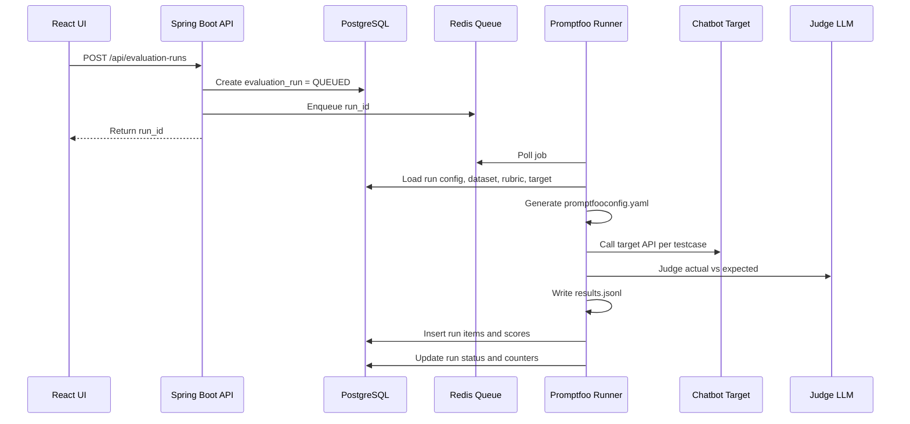

# Technical Design

## Dự án: Nền tảng nội bộ QC chatbot AI

### Phiên bản tài liệu

| Thuộc tính | Nội dung |
|---|---|
| Tên tài liệu | Technical Design |
| Backend | Spring Boot 4.1.0, Java 21, Maven, YAML |
| Frontend | React, Vite, Tailwind CSS v4 |
| Database | PostgreSQL |
| Queue/cache | Redis |
| Observability | Prometheus |
| Eval engine | Promptfoo CLI/engine chạy qua runner |

---

## 1. Mục tiêu kỹ thuật

Thiết kế hệ thống theo hướng platform nội bộ quản lý workflow QC, trong đó Promptfoo được dùng làm eval/red-team engine phía sau, không dùng Promptfoo UI làm UI chính của sản phẩm.

Lý do kỹ thuật:

1. UI cần tiếng Việt, dashboard theo nghiệp vụ QC, review flow riêng và mapping dataset Excel hiện tại.
2. Mỗi chatbot nội bộ có API response khác nhau, cần một lớp cấu hình/mapping riêng.
3. Platform cần auth, PostgreSQL, dashboard, audit và review workflow. Đây là phần không nên phụ thuộc vào UI mặc định của Promptfoo.
4. Promptfoo mạnh ở phần configuration, providers, assertions, eval execution và output export; nên dùng như engine thay vì fork UI.

---

## 2. Nguyên tắc thiết kế

| Nguyên tắc | Diễn giải |
|---|---|
| Engine tách khỏi platform | Spring Boot quản lý nghiệp vụ; Promptfoo chỉ chạy eval. |
| Không hard-code chatbot response | Mỗi chatbot phải cấu hình request template và response mapping. |
| Lưu raw data | Lưu raw response và raw promptfoo output để debug khi parser lỗi. |
| Rubric có version | Mỗi evaluation run phải biết đã dùng rubric version nào. |
| Judge status và QC status tách biệt | LLM judge có thể sai; QC phải có quyền review/override. |
| Secret không xuất hiện trong log | API key/token phải được mask và không ghi vào generated config nếu tránh được. |
| MVP đơn giản nhưng có đường nâng cấp | Một server 8GB trước, sau đó có thể scale runner/worker. |

---

## 3. Kiến trúc module

```text
qc-platform/
  backend/                  Spring Boot API
  frontend/                 React + Vite + Tailwind CSS v4
  runner/                   Worker chạy Promptfoo CLI
  deploy/                   Docker Compose, Prometheus config
  docs/                     Tài liệu dự án
```

### 3.1 Backend modules

| Module | Trách nhiệm |
|---|---|
| auth | Register, login, refresh token, logout, password hashing. |
| users | Quản lý user, role cơ bản. |
| projects | Quản lý project. |
| chatbot-targets | Quản lý cấu hình API chatbot và response mapping. |
| judge-models | Quản lý provider/model/API key cho LLM judge. |
| rubrics | Quản lý rubric và rubric version. |
| datasets | Upload, parse, validate Excel/CSV. |
| preconditions | Parse và lưu user metadata từ sheet `_PRECONDITIONS`. |
| evaluation-runs | Tạo run, enqueue job, theo dõi trạng thái. |
| evaluation-results | Lưu item result, scores, raw result, dashboard aggregation. |
| manual-reviews | QC review, override status, comment, PIC. |
| exports | Export CSV/XLSX. |
| observability | Metrics, health check, logs. |

### 3.2 Frontend modules

| Page | Mục đích |
|---|---|
| Login/Register | Auth cơ bản. |
| Project List | Danh sách project. |
| Project Detail | Tổng quan project, dataset, target, runs gần nhất. |
| Chatbot Target Config | Form cấu hình API target và response mapping. |
| Judge Model Config | Cấu hình LLM judge. |
| Rubric Editor | Nhập prompt/rubric, preview biến, lưu version. |
| Dataset Import | Upload Excel/CSV, preview sheet, validate lỗi. |
| Evaluation Run Detail | Xem trạng thái run, progress, log lỗi. |
| Result Table | Bảng kết quả, filter, search. |
| Result Review Detail | Expected vs actual, judge reason/scores, QC final decision. |
| Dashboard | Tổng quan pass/fail/pending, failed by section, latency. |

---

## 4. Thiết kế tùy biến response cho từng chatbot

### 4.1 Vấn đề

Mỗi chatbot có thể trả response khác nhau:

```json
{
  "answer": "..."
}
```

hoặc:

```json
{
  "data": {
    "message": {
      "content": "..."
    },
    "traceId": "..."
  }
}
```

hoặc:

```json
{
  "result": {
    "response": "...",
    "agent_steps": [],
    "used_tools": []
  },
  "meta": {
    "latency_ms": 1200
  }
}
```

Nếu code backend hard-code `response.answer`, platform chỉ dùng được cho một chatbot. Vì vậy cần một cơ chế adapter/mapping.

### 4.2 Giải pháp MVP: configurable response mapping

Mỗi `chatbot_target` có cấu hình:

```yaml
request:
  method: POST
  url: https://internal.example.com/chat
  headers:
    Authorization: Bearer {{CHATBOT_API_TOKEN}}
    Content-Type: application/json
  body:
    message: "{{input}}"
    user_metadata: "{{metadata}}"
    session_id: "{{session_id}}"

response_mapping:
  answer_path: "$.data.answer"
  trace_id_path: "$.data.trace_id"
  agent_steps_path: "$.debug.agent_steps"
  tools_path: "$.debug.tools"
  latency_ms_path: "$.latency_ms"
  error_path: "$.error.message"
```

Trong MVP, nên hỗ trợ JSONPath cho các field phổ biến. Nếu response phức tạp hơn, runner có thể dùng JavaScript transform tương tự cách Promptfoo HTTP provider cho phép transform response.

### 4.3 Màn hình cấu hình mapping

Màn hình `Chatbot Target Config` nên có các phần:

1. Request configuration:
   - URL
   - Method
   - Headers
   - Body template
   - Timeout

2. Sample input:
   - `custom_nlp_sample`
   - `user_metadata`
   - `session_id`

3. Sample response:
   - User paste raw JSON response đã mask dữ liệu nhạy cảm.

4. Response mapping:
   - `answer_path`
   - `trace_id_path`
   - `agent_steps_path`
   - `tools_path`
   - `latency_ms_path`
   - `error_path`

5. Preview:
   - Hệ thống hiển thị giá trị trích ra từ sample response.
   - Nếu `answer_path` không lấy được dữ liệu, không cho save hoặc hiển thị warning.

### 4.4 Sample response thật cần thu thập

Cần xin mentor/QC/dev backend một ví dụ như sau:

```http
POST /chat HTTP/1.1
Authorization: Bearer ***
Content-Type: application/json

{
  "message": "Tôi muốn xem chỉ số nhịp tim hôm nay",
  "user_metadata": {
    "user_id": "masked_user_id",
    "current_time": "2026-05-20T23:59:59"
  },
  "session_id": "test-session-001"
}
```

Response:

```json
{
  "status": "success",
  "data": {
    "answer": "Chỉ số nhịp tim hôm nay của bạn là 72 bpm.",
    "trace_id": "trace_abc_123"
  },
  "debug": {
    "agent_steps": [
      {"step": "query_health_data", "status": "success"}
    ],
    "tools": ["health_db_search"]
  },
  "latency_ms": 1840
}
```

Dữ liệu có thể mask, nhưng cấu trúc JSON nên giữ thật.

---

## 5. Promptfoo integration

### 5.1 Vai trò của Promptfoo

Promptfoo được dùng để:

1. Chạy test cases qua provider/target.
2. Thực hiện assertion hoặc LLM-based grading.
3. Xuất kết quả ra JSON/JSONL/CSV để platform parse.
4. Về sau có thể dùng red team engine.

Platform không cần expose toàn bộ Promptfoo config cho QC. Backend sẽ generate config dựa trên project/dataset/rubric.

### 5.2 Generated config concept

```yaml
description: "{{project_name}} - {{dataset_name}}"

prompts:
  - "{{custom_nlp_sample}}"

providers:
  - id: https
    label: "{{chatbot_target_name}}"
    config:
      url: "{{target_url}}"
      method: "{{target_method}}"
      headers:
        Content-Type: application/json
        Authorization: "Bearer {{env.CHATBOT_API_TOKEN}}"
      body:
        message: "{{prompt}}"
        user_metadata: "{{user_metadata}}"
        session_id: "{{session_id}}"
      transformResponse: "json.data.answer"

defaultTest:
  assert:
    - type: llm-rubric
      provider:
        id: "{{judge_provider_id}}"
      value: |
        {{rubric_content}}

tests:
  - vars:
      custom_nlp_sample: "..."
      custom_nlp_expected_dialog: "..."
      user_metadata: {}
      session_id: "run-1-case-1"
    metadata:
      test_case_id: "..."
      section_name: "..."
```

### 5.3 Output parsing

Runner nên chạy Promptfoo với output dạng JSON hoặc JSONL:

```bash
promptfoo eval -c promptfooconfig.yaml --output results.jsonl
```

Sau khi chạy xong:

1. Runner đọc output file.
2. Map từng result về `evaluation_run_items` theo `test_case_id` trong metadata.
3. Lưu `raw_result_json` để debug.
4. Parse judge response JSON nếu rubric yêu cầu output JSON.
5. Lưu scores vào `evaluation_scores`.
6. Update counters của `evaluation_runs`.

---

## 6. Rubric design

### 6.1 Rubric do QC tự prompt

Trong MVP, developer không cần tự định nghĩa toàn bộ rubric nghiệp vụ. QC/QC lead nhập prompt chấm trực tiếp trong Rubric Editor.

Tuy nhiên, để hệ thống parse được kết quả, rubric cần có output schema bắt buộc.

### 6.2 Rubric template đề xuất

```text
Bạn là QC evaluator cho chatbot AI nội bộ.

Hãy đánh giá câu trả lời của chatbot dựa trên input, ground truth và metadata.

Input của user:
{{input}}

Ground truth / expected dialog:
{{expected}}

Actual chatbot response:
{{actual}}

Agent steps / tools nếu có:
{{agent_steps}}

Yêu cầu đánh giá:
1. Chấm logic.
2. Chấm synthesis.
3. Chấm relevance.
4. Chấm plausibility.
5. Chấm tool_direction nếu có thông tin tool/agent steps.
6. Xác định final_status là Passed, Failed hoặc Pending.

Chỉ trả về JSON hợp lệ theo schema:
{
  "final_status": "Passed|Failed|Pending",
  "critical_error": "string|null",
  "overall_reason": "string",
  "scores": {
    "logic": {"score": 1, "reason": "string"},
    "synthesis": {"score": 1, "reason": "string"},
    "relevance": {"score": 1, "reason": "string"},
    "plausibility": {"score": 1, "reason": "string"},
    "tool_direction": {"score": 1, "reason": "string"}
  }
}
```

### 6.3 Status model

Không nên chỉ có một status duy nhất. Nên tách:

| Status | Nguồn | Ý nghĩa |
|---|---|---|
| `engine_status` | Promptfoo/judge | Kết quả tự động do engine xác định. |
| `judge_final_status` | LLM rubric JSON | Trạng thái do LLM judge trả về. |
| `qc_final_status` | QC manual review | Trạng thái cuối cùng sau khi QC chốt. |
| `effective_status` | Hệ thống tính | Nếu có QC override thì lấy `qc_final_status`, nếu chưa thì lấy `judge_final_status`. |

Cách này giúp vừa follow chuẩn Promptfoo, vừa giữ workflow QC thủ công cần thiết.

---

## 7. Dataset import design

### 7.1 File Excel hiện tại

Các sheet cần xử lý:

| Loại sheet | Cách xử lý |
|---|---|
| `Summary_Report` | Có thể bỏ qua khi import testcase; dùng để tham khảo dashboard cũ. |
| Sheet dataset như `Scan`, `Apple health`, `Shen AI_Health Connect`, `Shen AI_Garmin` | Parse thành dataset sections/test cases. |
| `_PRECONDITIONS` | Parse thành precondition/user metadata dictionary. |

### 7.2 Cột quan trọng

| Cột | Mapping |
|---|---|
| `section_name` | `test_cases.section_name` |
| `custom_preconds` | Parse `$RESET`, precondition refs, metadata refs. |
| `custom_nlp_sample` | Input gửi vào chatbot. |
| `custom_nlp_expected_dialog` | Ground truth/expected dùng cho judge. |
| `actual_chatbot_response` | Kết quả cũ nếu import report đã chạy; không bắt buộc với dataset mới. |
| `actual_agent_steps` | Debug/agent steps nếu có. |
| `inferred_actual_tools` | Tool calls nếu có. |
| `trace_id` | Trace để debug. |
| `eval_final_status` | Status cũ nếu import report đã có kết quả. |
| `eval_critical_error` | Error cũ nếu import report đã có kết quả. |
| `eval_json_llm_final` | Judge raw JSON cũ nếu có. |

### 7.3 Header normalization

Importer không nên phụ thuộc tuyệt đối vào vị trí cột. Cần normalize header:

1. Trim khoảng trắng.
2. Convert non-breaking space thành space thường.
3. Lowercase.
4. Replace multiple spaces bằng `_`.
5. Xử lý duplicate header bằng suffix `_2`, `_3`.
6. Cho phép alias, ví dụ `PIC` và `PIC bug` cùng map vào review PIC nếu cần.

### 7.4 Parse `custom_preconds`

Ví dụ:

```text
$RESET;_USER_METADATA_1
```

Kết quả parse:

```json
{
  "reset": true,
  "precondition_refs": ["_USER_METADATA_1"]
}
```

MVP behavior:

| Trường hợp | Xử lý |
|---|---|
| Có `$RESET` | Tạo session_id mới cho testcase. |
| Có `_USER_METADATA_X` | Inject JSON tương ứng từ sheet `_PRECONDITIONS`. |
| Không có `$RESET` | Vẫn tạo session mới trong MVP, ghi warning nếu cần multi-turn sau. |
| Ref không tồn tại | Mark testcase invalid hoặc import warning. |

---

## 8. Job execution design

### 8.1 Run lifecycle

```text
QUEUED → RUNNING → COMPLETED
                 ↘ FAILED
                 ↘ CANCELLED
```

### 8.2 Runner flow



### 8.3 Workdir

Mỗi run nên có workdir riêng:

```text
/work/evaluation-runs/{run_id}/
  promptfooconfig.yaml
  tests.jsonl
  results.jsonl
  stdout.log
  stderr.log
```

Sau khi parse xong:

1. Lưu raw output quan trọng vào DB hoặc object storage.
2. Mask secret trong log.
3. Có thể xóa file tạm hoặc giữ trong thời gian ngắn để debug.

---

## 9. API design

### 9.1 Authentication

```text
POST /api/auth/register
POST /api/auth/login
POST /api/auth/refresh
POST /api/auth/logout
GET  /api/auth/me
```

### 9.2 Projects

```text
GET    /api/projects
POST   /api/projects
GET    /api/projects/{projectId}
PATCH  /api/projects/{projectId}
```

### 9.3 Chatbot targets

```text
GET    /api/projects/{projectId}/targets
POST   /api/projects/{projectId}/targets
GET    /api/targets/{targetId}
PATCH  /api/targets/{targetId}
POST   /api/targets/{targetId}/test-connection
POST   /api/targets/{targetId}/validate-mapping
```

### 9.4 Judge models

```text
GET    /api/projects/{projectId}/judge-models
POST   /api/projects/{projectId}/judge-models
PATCH  /api/judge-models/{judgeModelId}
POST   /api/judge-models/{judgeModelId}/test-connection
```

### 9.5 Rubrics

```text
GET    /api/projects/{projectId}/rubrics
POST   /api/projects/{projectId}/rubrics
POST   /api/rubrics/{rubricId}/versions
GET    /api/rubrics/{rubricId}/versions
```

### 9.6 Datasets

```text
POST   /api/projects/{projectId}/datasets/import
GET    /api/projects/{projectId}/datasets
GET    /api/datasets/{datasetId}
GET    /api/datasets/{datasetId}/test-cases
GET    /api/datasets/{datasetId}/validation-report
```

### 9.7 Evaluation runs

```text
POST   /api/evaluation-runs
GET    /api/evaluation-runs/{runId}
GET    /api/evaluation-runs/{runId}/items
GET    /api/evaluation-runs/{runId}/summary
POST   /api/evaluation-runs/{runId}/cancel
GET    /api/evaluation-runs/{runId}/logs
```

### 9.8 Manual reviews

```text
PATCH  /api/evaluation-run-items/{itemId}/review
GET    /api/evaluation-run-items/{itemId}
```

### 9.9 Export

```text
GET    /api/evaluation-runs/{runId}/export.csv
GET    /api/evaluation-runs/{runId}/export.xlsx
```

---

## 10. Security design

### 10.1 Token

| Token | Thiết kế đề xuất |
|---|---|
| Access token | JWT, TTL 15 phút, trả trong body response. |
| Refresh token | Random opaque token, lưu trong HttpOnly Secure cookie. |
| Refresh token storage | Database chỉ lưu hash, không lưu raw token. |
| Rotation | Mỗi lần refresh thì rotate refresh token. |
| Logout | Revoke refresh token hiện tại. |

### 10.2 API keys/secrets

1. Judge API key và chatbot token không lưu plain text.
2. Sử dụng encryption at rest hoặc secret reference.
3. Không ghi secret vào log.
4. Khi generate promptfoo config, ưu tiên dùng env var thay vì ghi trực tiếp key.
5. Nếu phải ghi file tạm, file phải nằm trong workdir riêng và xóa sau run.

### 10.3 Logging

Log cần mask các pattern:

```text
Authorization: Bearer ***
api_key=***
OPENAI_API_KEY=***
GOOGLE_API_KEY=***
ANTHROPIC_API_KEY=***
```

---

## 11. Observability

### 11.1 Metrics đề xuất

| Metric | Ý nghĩa |
|---|---|
| `evaluation_runs_total` | Tổng số run tạo ra. |
| `evaluation_run_duration_seconds` | Thời gian chạy evaluation. |
| `evaluation_run_failed_total` | Số run failed. |
| `evaluation_items_total` | Số testcase đã xử lý. |
| `evaluation_item_failed_total` | Số testcase failed. |
| `chatbot_api_latency_seconds` | Latency gọi chatbot target. |
| `judge_llm_latency_seconds` | Latency gọi LLM judge. |
| `runner_job_queue_size` | Số job đang chờ. |

### 11.2 Health checks

```text
GET /actuator/health
GET /actuator/prometheus
```

Health check nên kiểm tra:

1. PostgreSQL connection.
2. Redis connection.
3. Runner heartbeat nếu có.

---

## 12. Testing strategy

| Loại test | Nội dung |
|---|---|
| Unit test | Parser custom_preconds, header normalization, response mapping. |
| Integration test | Dataset import Excel, create run, parse result JSONL. |
| Contract test | Test chatbot target mapping bằng sample response. |
| Security test | Token refresh rotation, password hash, secret masking. |
| UI smoke test | Login, import dataset, run eval, review result. |
| Runner test | Generate promptfoo config, run mock provider, parse output. |

---

## 13. Phụ thuộc kỹ thuật đề xuất

| Nhóm | Gợi ý |
|---|---|
| Backend | Spring Web, Spring Security, Spring Data JPA, Validation, Actuator. |
| DB migration | Flyway hoặc Liquibase. |
| PostgreSQL | JSONB cho raw response, metadata, mapping config. |
| Redis | Queue đơn giản hoặc dùng DB polling nếu muốn giảm scope. |
| Excel import/export | Apache POI. |
| JSONPath | Jayway JsonPath hoặc tự implement subset đơn giản. |
| Password hashing | BCrypt/Argon2 qua Spring Security. |
| Frontend | React, Vite, Tailwind CSS v4, TanStack Query, React Hook Form, Zod. |
| Runner | Node runtime + Promptfoo CLI. |

---

## 14. Quyết định kỹ thuật cho MVP

| Chủ đề | Quyết định đề xuất |
|---|---|
| UI chính | Tự build bằng React + Vite + Tailwind CSS v4. |
| Promptfoo UI | Không fork trong MVP. |
| Eval engine | Promptfoo CLI chạy trong runner container. |
| Dataset format | Import Excel hiện tại trước, CSV sau. |
| Response mapping | JSONPath cho MVP; JavaScript transform cho phase sau nếu cần. |
| Rubric | QC tự nhập prompt nhưng bắt buộc output JSON schema. |
| Status | Tách judge/engine status và QC final status. |
| Auth | Local auth trước; SSO phase sau nếu thiếu thời gian. |
| Deploy | Docker Compose trên một server 8GB. |

## Tài liệu tham khảo công khai

- Promptfoo Configuration Overview: https://www.promptfoo.dev/docs/configuration/guide/
- Promptfoo HTTP/HTTPS Provider: https://www.promptfoo.dev/docs/providers/http/
- Promptfoo Output Formats: https://www.promptfoo.dev/docs/configuration/outputs/
- Promptfoo Self-hosting: https://www.promptfoo.dev/docs/usage/self-hosting/
