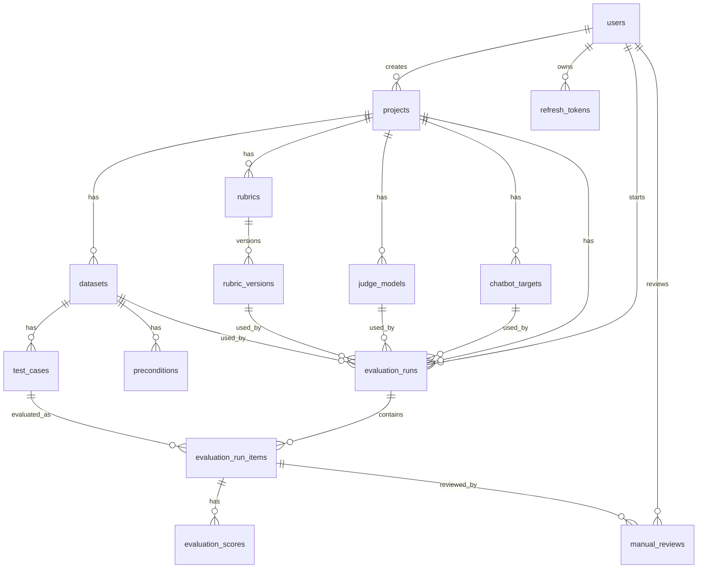

# Data Model

## Dự án: Nền tảng nội bộ QC chatbot AI

### Phiên bản tài liệu

| Thuộc tính | Nội dung |
|---|---|
| Tên tài liệu | Data Model |
| Database chính | PostgreSQL |
| Kiểu dữ liệu linh hoạt | JSONB cho metadata, raw response, mapping config, raw result |
| Trạng thái | Bản đề xuất cho MVP |

---

## 1. Tổng quan entity

Các entity chính:

1. `users`
2. `projects`
3. `chatbot_targets`
4. `judge_models`
5. `rubrics`
6. `rubric_versions`
7. `datasets`
8. `preconditions`
9. `test_cases`
10. `evaluation_runs`
11. `evaluation_run_items`
12. `evaluation_scores`
13. `manual_reviews`
14. `refresh_tokens`
15. `audit_logs`

---

## 2. ERD mức khái niệm



---

## 3. Enum đề xuất

### 3.1 User role

```text
ADMIN
QC_LEAD
QC_TESTER
```

### 3.2 Auth provider

```text
LOCAL
GOOGLE
GITHUB
```

### 3.3 Run status

```text
QUEUED
RUNNING
COMPLETED
FAILED
CANCELLED
```

### 3.4 Item status

```text
PASSED
FAILED
PENDING
ERROR
SKIPPED
```

### 3.5 Dataset source type

```text
EXCEL
CSV
MANUAL
GENERATED
```

### 3.6 Judge provider

```text
OPENAI
GEMINI
ANTHROPIC
DEEPSEEK
CUSTOM
```

---

## 4. Bảng `users`

Lưu thông tin người dùng.

| Column | Type | Required | Mô tả |
|---|---|---:|---|
| id | UUID | Yes | Primary key. |
| email | VARCHAR(255) | Yes | Unique. |
| password_hash | TEXT | No | Null nếu user chỉ dùng SSO. |
| display_name | VARCHAR(255) | Yes | Tên hiển thị. |
| provider | VARCHAR(32) | Yes | LOCAL/GOOGLE/GITHUB. |
| provider_subject | VARCHAR(255) | No | ID từ provider SSO. |
| role | VARCHAR(32) | Yes | ADMIN/QC_LEAD/QC_TESTER. |
| enabled | BOOLEAN | Yes | User có được đăng nhập không. |
| created_at | TIMESTAMPTZ | Yes | Thời điểm tạo. |
| updated_at | TIMESTAMPTZ | Yes | Thời điểm cập nhật. |

Index:

```sql
CREATE UNIQUE INDEX uq_users_email ON users(email);
```

---

## 5. Bảng `refresh_tokens`

Lưu refresh token đã hash.

| Column | Type | Required | Mô tả |
|---|---|---:|---|
| id | UUID | Yes | Primary key. |
| user_id | UUID | Yes | FK users. |
| token_hash | TEXT | Yes | Hash của refresh token. |
| expires_at | TIMESTAMPTZ | Yes | Hết hạn. |
| revoked_at | TIMESTAMPTZ | No | Thời điểm revoke. |
| replaced_by_token_id | UUID | No | Token mới sau rotation. |
| user_agent | TEXT | No | User agent. |
| ip_address | INET | No | IP. |
| created_at | TIMESTAMPTZ | Yes | Thời điểm tạo. |

---

## 6. Bảng `projects`

| Column | Type | Required | Mô tả |
|---|---|---:|---|
| id | UUID | Yes | Primary key. |
| name | VARCHAR(255) | Yes | Tên project. |
| description | TEXT | No | Mô tả. |
| created_by | UUID | Yes | FK users. |
| created_at | TIMESTAMPTZ | Yes | Thời điểm tạo. |
| updated_at | TIMESTAMPTZ | Yes | Thời điểm cập nhật. |

Ví dụ:

```text
AI HEALTH - ScanAI Round 2
```

---

## 7. Bảng `chatbot_targets`

Lưu cấu hình chatbot cần chấm.

| Column | Type | Required | Mô tả |
|---|---|---:|---|
| id | UUID | Yes | Primary key. |
| project_id | UUID | Yes | FK projects. |
| name | VARCHAR(255) | Yes | Tên chatbot target. |
| method | VARCHAR(16) | Yes | GET/POST/PUT. |
| url | TEXT | Yes | Endpoint chatbot. |
| headers_template_json | JSONB | No | Header template, không nên chứa secret plain text. |
| body_template_json | JSONB | No | Body template. |
| query_params_template_json | JSONB | No | Query params nếu có. |
| response_mapping_json | JSONB | Yes | Mapping field response. |
| timeout_seconds | INTEGER | Yes | Timeout gọi chatbot. |
| secret_ref | VARCHAR(255) | No | Ref tới token/secret nếu cần. |
| enabled | BOOLEAN | Yes | Có được dùng không. |
| created_at | TIMESTAMPTZ | Yes | Thời điểm tạo. |
| updated_at | TIMESTAMPTZ | Yes | Thời điểm cập nhật. |

Ví dụ `response_mapping_json`:

```json
{
  "answer_path": "$.data.answer",
  "trace_id_path": "$.data.trace_id",
  "agent_steps_path": "$.debug.agent_steps",
  "tools_path": "$.debug.tools",
  "latency_ms_path": "$.latency_ms",
  "error_path": "$.error.message"
}
```

---

## 8. Bảng `judge_models`

Lưu cấu hình LLM dùng để chấm.

| Column | Type | Required | Mô tả |
|---|---|---:|---|
| id | UUID | Yes | Primary key. |
| project_id | UUID | Yes | FK projects. |
| name | VARCHAR(255) | Yes | Tên cấu hình. |
| provider | VARCHAR(32) | Yes | OPENAI/GEMINI/ANTHROPIC/DEEPSEEK/CUSTOM. |
| model_name | VARCHAR(255) | Yes | Tên model. |
| base_url | TEXT | No | Custom base URL nếu có. |
| api_key_secret_ref | VARCHAR(255) | No | Secret reference hoặc encrypted key ref. |
| config_json | JSONB | No | Config thêm như temperature, max tokens. |
| enabled | BOOLEAN | Yes | Có được dùng không. |
| created_at | TIMESTAMPTZ | Yes | Thời điểm tạo. |
| updated_at | TIMESTAMPTZ | Yes | Thời điểm cập nhật. |

---

## 9. Bảng `rubrics`

| Column | Type | Required | Mô tả |
|---|---|---:|---|
| id | UUID | Yes | Primary key. |
| project_id | UUID | Yes | FK projects. |
| name | VARCHAR(255) | Yes | Tên rubric. |
| description | TEXT | No | Mô tả. |
| created_by | UUID | Yes | FK users. |
| created_at | TIMESTAMPTZ | Yes | Thời điểm tạo. |
| updated_at | TIMESTAMPTZ | Yes | Thời điểm cập nhật. |

---

## 10. Bảng `rubric_versions`

Mỗi lần sửa rubric tạo version mới.

| Column | Type | Required | Mô tả |
|---|---|---:|---|
| id | UUID | Yes | Primary key. |
| rubric_id | UUID | Yes | FK rubrics. |
| version | INTEGER | Yes | Số version. |
| content | TEXT | Yes | Prompt/rubric content. |
| output_schema_json | JSONB | Yes | JSON schema mong muốn. |
| criteria_json | JSONB | No | Danh sách tiêu chí và trọng số. |
| threshold_json | JSONB | No | Ngưỡng pass/fail nếu có. |
| created_by | UUID | Yes | FK users. |
| created_at | TIMESTAMPTZ | Yes | Thời điểm tạo. |

Index:

```sql
CREATE UNIQUE INDEX uq_rubric_versions ON rubric_versions(rubric_id, version);
```

---

## 11. Bảng `datasets`

| Column | Type | Required | Mô tả |
|---|---|---:|---|
| id | UUID | Yes | Primary key. |
| project_id | UUID | Yes | FK projects. |
| name | VARCHAR(255) | Yes | Tên dataset. |
| source_type | VARCHAR(32) | Yes | EXCEL/CSV/MANUAL/GENERATED. |
| source_file_name | TEXT | No | Tên file gốc. |
| source_file_hash | TEXT | No | Hash để tránh import trùng nếu cần. |
| import_summary_json | JSONB | No | Tổng kết import, warning, số dòng. |
| created_by | UUID | Yes | FK users. |
| created_at | TIMESTAMPTZ | Yes | Thời điểm tạo. |
| updated_at | TIMESTAMPTZ | Yes | Thời điểm cập nhật. |

---

## 12. Bảng `preconditions`

Lưu metadata từ sheet `_PRECONDITIONS`.

| Column | Type | Required | Mô tả |
|---|---|---:|---|
| id | UUID | Yes | Primary key. |
| dataset_id | UUID | Yes | FK datasets. |
| name | VARCHAR(255) | Yes | Ví dụ `_USER_METADATA_1`. |
| value_json | JSONB | Yes | Metadata JSON. |
| raw_value | TEXT | No | Raw text từ Excel nếu cần debug. |
| created_at | TIMESTAMPTZ | Yes | Thời điểm tạo. |

Index:

```sql
CREATE UNIQUE INDEX uq_preconditions_dataset_name ON preconditions(dataset_id, name);
```

---

## 13. Bảng `test_cases`

Lưu từng testcase sau khi import.

| Column | Type | Required | Mô tả |
|---|---|---:|---|
| id | UUID | Yes | Primary key. |
| dataset_id | UUID | Yes | FK datasets. |
| sheet_name | VARCHAR(255) | No | Tên sheet gốc. |
| row_index | INTEGER | Yes | Dòng trong file gốc. |
| section_name | TEXT | No | Nhóm testcase. |
| custom_preconds_raw | TEXT | No | Raw preconditions string. |
| precondition_refs_json | JSONB | No | Danh sách refs đã parse. |
| reset_session | BOOLEAN | Yes | Có `$RESET` hay không. |
| custom_nlp_sample | TEXT | Yes | Input gửi chatbot. |
| custom_nlp_expected_dialog | TEXT | Yes | Ground truth/expected. |
| metadata_json | JSONB | No | Metadata đã resolve từ preconditions. |
| import_warnings_json | JSONB | No | Warning khi import. |
| enabled | BOOLEAN | Yes | Có chạy testcase này không. |
| created_at | TIMESTAMPTZ | Yes | Thời điểm tạo. |
| updated_at | TIMESTAMPTZ | Yes | Thời điểm cập nhật. |

Index:

```sql
CREATE INDEX idx_test_cases_dataset ON test_cases(dataset_id);
CREATE INDEX idx_test_cases_section ON test_cases(dataset_id, section_name);
```

---

## 14. Bảng `evaluation_runs`

Lưu mỗi lần chạy evaluation.

| Column | Type | Required | Mô tả |
|---|---|---:|---|
| id | UUID | Yes | Primary key. |
| project_id | UUID | Yes | FK projects. |
| dataset_id | UUID | Yes | FK datasets. |
| chatbot_target_id | UUID | Yes | FK chatbot_targets. |
| judge_model_id | UUID | Yes | FK judge_models. |
| rubric_version_id | UUID | Yes | FK rubric_versions. |
| status | VARCHAR(32) | Yes | QUEUED/RUNNING/COMPLETED/FAILED/CANCELLED. |
| total_cases | INTEGER | Yes | Tổng số testcase. |
| passed_count | INTEGER | Yes | Số passed theo effective status. |
| failed_count | INTEGER | Yes | Số failed theo effective status. |
| pending_count | INTEGER | Yes | Số pending theo effective status. |
| error_count | INTEGER | Yes | Số technical error. |
| config_snapshot_json | JSONB | No | Snapshot config tại thời điểm chạy. |
| started_at | TIMESTAMPTZ | No | Bắt đầu chạy. |
| finished_at | TIMESTAMPTZ | No | Kết thúc chạy. |
| created_by | UUID | Yes | FK users. |
| created_at | TIMESTAMPTZ | Yes | Thời điểm tạo. |
| updated_at | TIMESTAMPTZ | Yes | Thời điểm cập nhật. |

Index:

```sql
CREATE INDEX idx_evaluation_runs_project_created ON evaluation_runs(project_id, created_at DESC);
CREATE INDEX idx_evaluation_runs_status ON evaluation_runs(status);
```

---

## 15. Bảng `evaluation_run_items`

Lưu kết quả từng testcase trong một run.

| Column | Type | Required | Mô tả |
|---|---|---:|---|
| id | UUID | Yes | Primary key. |
| run_id | UUID | Yes | FK evaluation_runs. |
| test_case_id | UUID | Yes | FK test_cases. |
| engine_status | VARCHAR(32) | No | Status từ Promptfoo/assertion. |
| judge_final_status | VARCHAR(32) | No | Status từ rubric JSON. |
| qc_final_status | VARCHAR(32) | No | Status do QC chốt gần nhất. |
| effective_status | VARCHAR(32) | Yes | Status hệ thống dùng cho dashboard. |
| actual_chatbot_response | TEXT | No | Câu trả lời chính của chatbot. |
| actual_agent_steps_json | JSONB | No | Agent steps. |
| actual_tools_json | JSONB | No | Tools/tool calls. |
| trace_id | TEXT | No | Trace ID. |
| session_id | TEXT | No | Session ID khi chạy. |
| final_prompt | TEXT | No | Prompt cuối dùng cho judge nếu cần debug. |
| judge_raw_output | TEXT | No | Raw output của judge. |
| judge_parsed_json | JSONB | No | JSON parse từ judge. |
| critical_error | TEXT | No | Critical error do judge hoặc hệ thống xác định. |
| overall_reason | TEXT | No | Reason tổng quan. |
| time_to_first_token_ms | INTEGER | No | Latency nếu có. |
| latency_ms | INTEGER | No | Latency tổng. |
| time_to_last_token_ms | INTEGER | No | Latency nếu có. |
| raw_chatbot_response_json | JSONB | No | Raw response chatbot. |
| raw_promptfoo_result_json | JSONB | No | Raw result từ Promptfoo. |
| error_message | TEXT | No | Technical error nếu có. |
| created_at | TIMESTAMPTZ | Yes | Thời điểm tạo. |
| updated_at | TIMESTAMPTZ | Yes | Thời điểm cập nhật. |

Index:

```sql
CREATE INDEX idx_run_items_run ON evaluation_run_items(run_id);
CREATE INDEX idx_run_items_status ON evaluation_run_items(run_id, effective_status);
CREATE INDEX idx_run_items_trace ON evaluation_run_items(trace_id);
```

---

## 16. Bảng `evaluation_scores`

Lưu score theo metric.

| Column | Type | Required | Mô tả |
|---|---|---:|---|
| id | UUID | Yes | Primary key. |
| run_item_id | UUID | Yes | FK evaluation_run_items. |
| metric_name | VARCHAR(128) | Yes | logic/synthesis/relevance/plausibility/tool_direction. |
| score | NUMERIC(6,2) | No | Điểm. |
| max_score | NUMERIC(6,2) | No | Điểm tối đa, ví dụ 5. |
| reason | TEXT | No | Lý do. |
| created_at | TIMESTAMPTZ | Yes | Thời điểm tạo. |

Index:

```sql
CREATE UNIQUE INDEX uq_evaluation_scores_item_metric ON evaluation_scores(run_item_id, metric_name);
```

---

## 17. Bảng `manual_reviews`

Lưu lịch sử review thủ công. Không nên chỉ update trực tiếp `evaluation_run_items` mà mất lịch sử.

| Column | Type | Required | Mô tả |
|---|---|---:|---|
| id | UUID | Yes | Primary key. |
| run_item_id | UUID | Yes | FK evaluation_run_items. |
| reviewer_id | UUID | Yes | FK users. |
| final_status | VARCHAR(32) | Yes | PASSED/FAILED/PENDING. |
| critical_error | TEXT | No | Error do QC ghi. |
| pic | VARCHAR(255) | No | Người/nhóm phụ trách bug. |
| comment | TEXT | No | Comment review. |
| created_at | TIMESTAMPTZ | Yes | Thời điểm tạo review. |

Khi tạo manual review mới, hệ thống update:

```text
evaluation_run_items.qc_final_status = manual_reviews.final_status
evaluation_run_items.effective_status = manual_reviews.final_status
```

---

## 18. Bảng `audit_logs`

| Column | Type | Required | Mô tả |
|---|---|---:|---|
| id | UUID | Yes | Primary key. |
| actor_user_id | UUID | No | User thực hiện. |
| action | VARCHAR(255) | Yes | Ví dụ CREATE_RUN, UPDATE_REVIEW. |
| entity_type | VARCHAR(128) | Yes | Loại entity. |
| entity_id | UUID | No | ID entity. |
| before_json | JSONB | No | Dữ liệu trước khi sửa. |
| after_json | JSONB | No | Dữ liệu sau khi sửa. |
| ip_address | INET | No | IP. |
| user_agent | TEXT | No | User agent. |
| created_at | TIMESTAMPTZ | Yes | Thời điểm tạo. |

---

## 19. Mapping từ Excel hiện tại sang model

| Excel column/sheet | Entity/column |
|---|---|
| Sheet dataset name | `test_cases.sheet_name` hoặc một phần của dataset import summary. |
| `section_name` | `test_cases.section_name` |
| `custom_preconds` | `test_cases.custom_preconds_raw`, `reset_session`, `precondition_refs_json` |
| `_PRECONDITIONS` sheet | `preconditions.name`, `preconditions.value_json` |
| `custom_nlp_sample` | `test_cases.custom_nlp_sample` |
| `custom_nlp_expected_dialog` | `test_cases.custom_nlp_expected_dialog` |
| `actual_chatbot_response` | `evaluation_run_items.actual_chatbot_response` nếu import report cũ. |
| `actual_agent_steps` | `evaluation_run_items.actual_agent_steps_json` nếu import report cũ. |
| `actual_tool` / `inferred_actual_tools` | `evaluation_run_items.actual_tools_json` nếu import report cũ. |
| `trace_id` | `evaluation_run_items.trace_id` nếu import report cũ. |
| `final_prompt` | `evaluation_run_items.final_prompt` nếu import report cũ. |
| `eval_final_status` | `evaluation_run_items.judge_final_status` hoặc `effective_status` khi import report cũ. |
| `eval_critical_error` | `evaluation_run_items.critical_error` |
| `eval_json_llm_final` | `evaluation_run_items.judge_parsed_json` hoặc `judge_raw_output` |
| `eval_logic_score` | `evaluation_scores(metric_name='logic')` |
| `eval_synthesis_score` | `evaluation_scores(metric_name='synthesis')` |
| `eval_relevance_score` | `evaluation_scores(metric_name='relevance')` |
| `eval_plausibility_score` | `evaluation_scores(metric_name='plausibility')` |
| `tool_direction_score` | `evaluation_scores(metric_name='tool_direction')` |
| `PIC` / `PIC bug` | `manual_reviews.pic` nếu QC review/import report cũ. |

---

## 20. DDL khởi tạo rút gọn

Đây là bản rút gọn để bắt đầu. Khi implement nên dùng Flyway/Liquibase migration.

```sql
CREATE TABLE users (
    id UUID PRIMARY KEY,
    email VARCHAR(255) NOT NULL UNIQUE,
    password_hash TEXT,
    display_name VARCHAR(255) NOT NULL,
    provider VARCHAR(32) NOT NULL,
    provider_subject VARCHAR(255),
    role VARCHAR(32) NOT NULL,
    enabled BOOLEAN NOT NULL DEFAULT TRUE,
    created_at TIMESTAMPTZ NOT NULL,
    updated_at TIMESTAMPTZ NOT NULL
);

CREATE TABLE projects (
    id UUID PRIMARY KEY,
    name VARCHAR(255) NOT NULL,
    description TEXT,
    created_by UUID NOT NULL REFERENCES users(id),
    created_at TIMESTAMPTZ NOT NULL,
    updated_at TIMESTAMPTZ NOT NULL
);

CREATE TABLE chatbot_targets (
    id UUID PRIMARY KEY,
    project_id UUID NOT NULL REFERENCES projects(id),
    name VARCHAR(255) NOT NULL,
    method VARCHAR(16) NOT NULL,
    url TEXT NOT NULL,
    headers_template_json JSONB,
    body_template_json JSONB,
    query_params_template_json JSONB,
    response_mapping_json JSONB NOT NULL,
    timeout_seconds INTEGER NOT NULL DEFAULT 60,
    secret_ref VARCHAR(255),
    enabled BOOLEAN NOT NULL DEFAULT TRUE,
    created_at TIMESTAMPTZ NOT NULL,
    updated_at TIMESTAMPTZ NOT NULL
);

CREATE TABLE datasets (
    id UUID PRIMARY KEY,
    project_id UUID NOT NULL REFERENCES projects(id),
    name VARCHAR(255) NOT NULL,
    source_type VARCHAR(32) NOT NULL,
    source_file_name TEXT,
    source_file_hash TEXT,
    import_summary_json JSONB,
    created_by UUID NOT NULL REFERENCES users(id),
    created_at TIMESTAMPTZ NOT NULL,
    updated_at TIMESTAMPTZ NOT NULL
);

CREATE TABLE test_cases (
    id UUID PRIMARY KEY,
    dataset_id UUID NOT NULL REFERENCES datasets(id),
    sheet_name VARCHAR(255),
    row_index INTEGER NOT NULL,
    section_name TEXT,
    custom_preconds_raw TEXT,
    precondition_refs_json JSONB,
    reset_session BOOLEAN NOT NULL DEFAULT FALSE,
    custom_nlp_sample TEXT NOT NULL,
    custom_nlp_expected_dialog TEXT NOT NULL,
    metadata_json JSONB,
    import_warnings_json JSONB,
    enabled BOOLEAN NOT NULL DEFAULT TRUE,
    created_at TIMESTAMPTZ NOT NULL,
    updated_at TIMESTAMPTZ NOT NULL
);
```

---

## 21. Lưu ý triển khai

1. Các cột raw JSON nên dùng JSONB để dễ query và debug.
2. Không nên xóa lịch sử manual review; mỗi lần QC sửa nên tạo record mới.
3. Nên có `config_snapshot_json` trong `evaluation_runs` để kết quả cũ không bị phụ thuộc config mới.
4. `effective_status` giúp dashboard nhanh hơn, nhưng phải update cẩn thận khi QC override.
5. Nếu dataset lớn, cần pagination cho `test_cases` và `evaluation_run_items`.
6. Các field latency có thể null vì không phải chatbot nào cũng trả latency.
