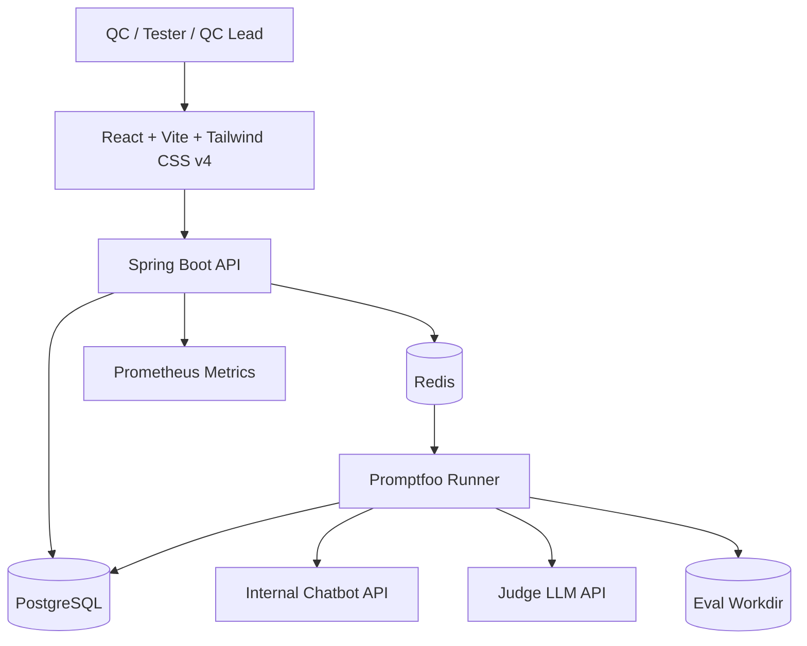
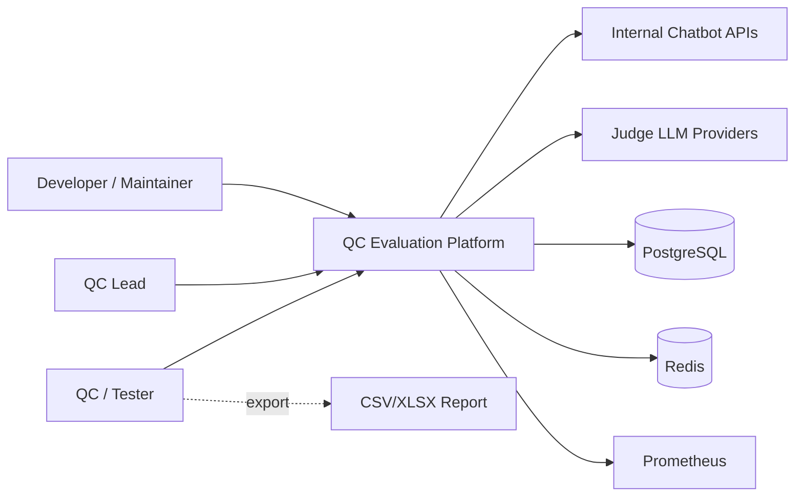
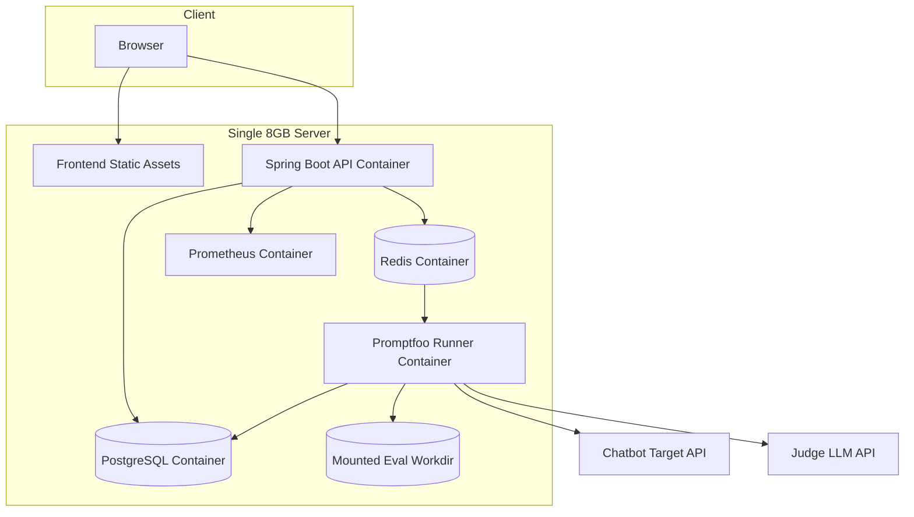
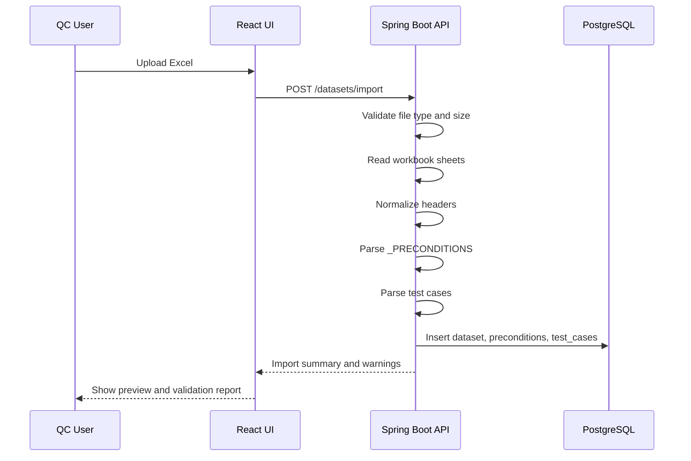
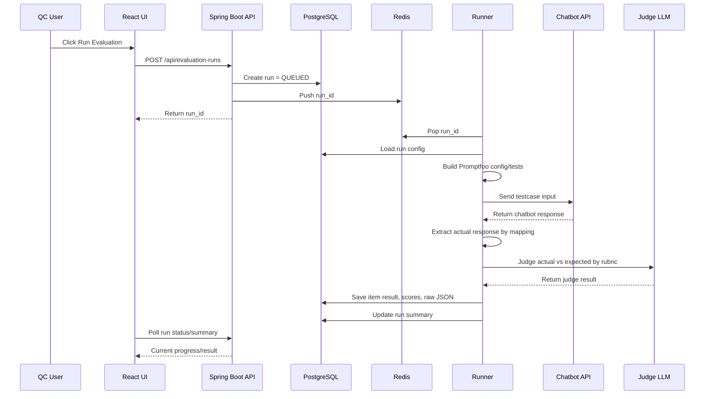
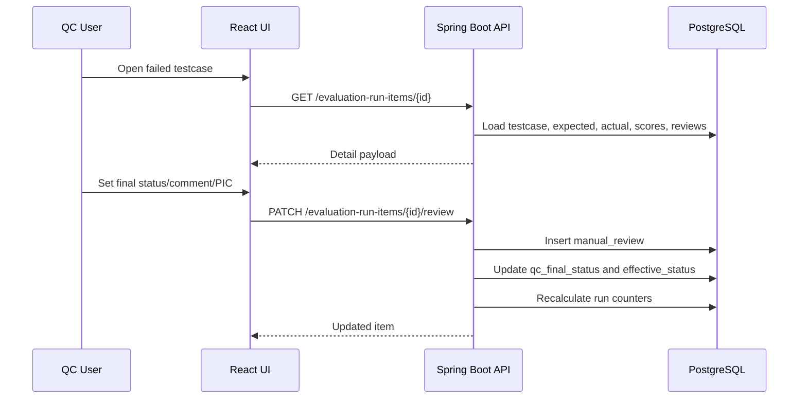

# Architecture Document

## Dự án: Nền tảng nội bộ QC chatbot AI

### Phiên bản tài liệu

| Thuộc tính | Nội dung |
|---|---|
| Tên tài liệu | Architecture Document |
| Mục tiêu | Mô tả kiến trúc hệ thống MVP và hướng mở rộng |
| Runtime chính | Docker Compose trên một server 8GB |
| Kiến trúc | Web app + API backend + database + queue + runner |

---

## 1. Tổng quan kiến trúc

Nền tảng được thiết kế theo hướng tách biệt rõ ràng giữa:

1. Web UI cho QC/tester.
2. Backend quản lý nghiệp vụ, auth, dataset, run, review, dashboard.
3. Database lưu trạng thái và kết quả.
4. Runner chạy evaluation thông qua Promptfoo.
5. Chatbot target API và Judge LLM API là hệ thống bên ngoài.



---

## 2. C4 Context



### Mô tả

| Đối tượng | Vai trò |
|---|---|
| QC/tester | Import dataset, chạy evaluation, review result. |
| QC lead | Quản lý rubric, xem dashboard, chốt chất lượng. |
| Developer/maintainer | Cấu hình API target, xử lý mapping, vận hành hệ thống. |
| Internal Chatbot APIs | Các chatbot nội bộ cần được đánh giá. |
| Judge LLM Providers | OpenAI/Gemini/Anthropic/Deepseek/custom LLM dùng để chấm. |
| PostgreSQL | Lưu dữ liệu nghiệp vụ và kết quả. |
| Redis | Queue/cache cho evaluation jobs. |
| Prometheus | Thu metrics vận hành. |

---

## 3. Container architecture



---

## 4. Deployment MVP

### 4.1 Docker Compose services

| Service | Vai trò | Ghi chú |
|---|---|---|
| `frontend` | Serve React build hoặc dùng Nginx | Có thể gộp vào backend nếu muốn đơn giản. |
| `backend` | Spring Boot API | Port nội bộ 8080. |
| `runner` | Worker chạy Promptfoo CLI | Có Node runtime và promptfoo CLI. |
| `postgres` | Database chính | Mount volume. |
| `redis` | Queue/cache | Mount volume nếu cần persistence. |
| `prometheus` | Metrics | Đọc `/actuator/prometheus`. |

### 4.2 Docker Compose concept

```yaml
services:
  backend:
    image: qc-platform-backend:latest
    ports:
      - "8080:8080"
    environment:
      SPRING_PROFILES_ACTIVE: prod
      DATABASE_URL: jdbc:postgresql://postgres:5432/qc_platform
      REDIS_HOST: redis
    depends_on:
      - postgres
      - redis

  frontend:
    image: qc-platform-frontend:latest
    ports:
      - "80:80"
    depends_on:
      - backend

  runner:
    image: qc-platform-runner:latest
    environment:
      DATABASE_URL: jdbc:postgresql://postgres:5432/qc_platform
      REDIS_HOST: redis
      PROMPTFOO_WORKDIR: /work
    volumes:
      - ./eval-workdir:/work
    depends_on:
      - postgres
      - redis

  postgres:
    image: postgres:17
    environment:
      POSTGRES_DB: qc_platform
      POSTGRES_USER: qc_platform
      POSTGRES_PASSWORD: change_me
    volumes:
      - postgres_data:/var/lib/postgresql/data

  redis:
    image: redis:7
    command: redis-server --appendonly yes
    volumes:
      - redis_data:/data

  prometheus:
    image: prom/prometheus
    volumes:
      - ./prometheus.yml:/etc/prometheus/prometheus.yml
    ports:
      - "9090:9090"

volumes:
  postgres_data:
  redis_data:
```

---

## 5. Runtime flow: Import dataset



### Import validation

| Validation | Mức độ |
|---|---|
| Thiếu `custom_nlp_sample` | Error |
| Thiếu `custom_nlp_expected_dialog` | Error hoặc warning tùy mode |
| Precondition ref không tồn tại | Error cho testcase đó |
| Duplicate header | Warning, tự rename nội bộ |
| Empty row | Skip |
| `section_name` rỗng | Warning hoặc inherit từ dòng trước nếu bật option |

---

## 6. Runtime flow: Run evaluation



---

## 7. Runtime flow: Manual review



---

## 8. Component responsibilities

### 8.1 Frontend

| Trách nhiệm | Chi tiết |
|---|---|
| UI workflow | Project, config, import, run, result, review. |
| Form validation | Validate required fields trước khi gọi API. |
| Preview mapping | Hiển thị sample response và extracted fields. |
| Result navigation | Filter/search/pagination. |
| Review experience | Expected vs actual side-by-side, keyboard-friendly nếu có thời gian. |

Không nên để frontend tự gọi chatbot target hoặc judge LLM trực tiếp vì sẽ lộ secret và khó audit.

### 8.2 Backend

| Trách nhiệm | Chi tiết |
|---|---|
| Auth/session | JWT access token, refresh token cookie. |
| Business API | CRUD project, target, dataset, run, review. |
| Import | Parse Excel/CSV, validate, lưu DB. |
| Queue orchestration | Tạo job và enqueue. |
| Dashboard aggregation | Query và aggregate run results. |
| Export | CSV/XLSX. |
| Secret management | Encrypt/mask/resolve secret ref. |

### 8.3 Runner

| Trách nhiệm | Chi tiết |
|---|---|
| Job execution | Nhận run_id từ Redis hoặc DB. |
| Config generation | Tạo promptfooconfig.yaml/tests file từ DB. |
| Promptfoo execution | Chạy CLI và capture output. |
| Result ingestion | Parse JSON/JSONL, lưu result vào DB. |
| Error handling | Mark run failed, lưu log đã mask. |

---

## 9. Data flow boundaries

```text
Browser
  Không giữ API key judge/chatbot.
  Không gọi trực tiếp chatbot target.

Backend
  Nhận và validate config.
  Lưu secret ref/encrypted secret.
  Điều phối run.

Runner
  Resolve secret lúc chạy.
  Gọi chatbot và judge LLM.
  Ghi raw result đã mask về DB.
```

---

## 10. Security architecture

### 10.1 Auth

```text
Login thành công
→ Backend trả access token trong response body
→ Backend set refresh token vào HttpOnly Secure cookie
→ Frontend dùng access token gọi API
→ Khi hết hạn, frontend gọi refresh endpoint
→ Backend rotate refresh token
```

### 10.2 Secret handling

1. Secret nhập từ UI phải gửi qua HTTPS khi deploy thật.
2. Backend encrypt trước khi lưu hoặc lưu secret reference.
3. Runner chỉ lấy secret lúc cần chạy.
4. Log phải mask secret.
5. Generated config không nên chứa raw secret; ưu tiên env var hoặc runtime injection.

---

## 11. Scaling path sau MVP

| Giai đoạn | Hướng nâng cấp |
|---|---|
| MVP | Một backend, một runner, một PostgreSQL, một Redis. |
| Sau MVP | Nhiều runner cùng đọc Redis queue. |
| Khi dataset lớn | Batch testcase, concurrency control, retry per item. |
| Khi nhiều team dùng | Multi-project RBAC, workspace/team, audit đầy đủ. |
| Khi cần production | Managed PostgreSQL, object storage cho artifacts, secret manager, CI/CD. |
| Khi cần observability tốt hơn | Grafana dashboard, alerting, centralized logs. |

---

## 12. Failure modes

| Failure | Cách xử lý |
|---|---|
| Chatbot target timeout | Mark item ERROR, lưu error message, tiếp tục testcase khác nếu được. |
| Judge LLM timeout | Retry giới hạn, nếu vẫn lỗi mark item ERROR/PENDING. |
| Promptfoo CLI exit non-zero | Mark run FAILED nếu lỗi hệ thống; lưu stderr đã mask. |
| Parser không đọc được judge JSON | Lưu raw output, mark item PENDING hoặc ERROR, QC review thủ công. |
| Redis mất kết nối | Backend không enqueue được, trả lỗi rõ; runner retry connection. |
| PostgreSQL lỗi | Stop run an toàn, không ghi partial không rõ trạng thái. |
| Server restart giữa run | Runner cần idempotent hoặc run được mark FAILED/INTERRUPTED để chạy lại. |

---

## 13. Architecture decision records

### ADR-001: Không fork Promptfoo UI trong MVP

| Mục | Nội dung |
|---|---|
| Quyết định | Tự build UI bằng React; Promptfoo chỉ là eval engine. |
| Lý do | UI cần tiếng Việt, dashboard QC, auth, review workflow, import Excel. |
| Hệ quả | Cần viết runner và parser result. |

### ADR-002: Dùng response mapping thay vì hard-code chatbot response

| Mục | Nội dung |
|---|---|
| Quyết định | Mỗi chatbot target có `response_mapping_json`. |
| Lý do | Mỗi chatbot trả response khác nhau. |
| Hệ quả | Cần màn hình test mapping bằng sample response. |

### ADR-003: Rubric do QC quản lý nhưng phải có output schema

| Mục | Nội dung |
|---|---|
| Quyết định | QC nhập rubric prompt, hệ thống bắt buộc output JSON schema. |
| Lý do | QC hiểu nghiệp vụ; backend cần parse kết quả ổn định. |
| Hệ quả | Cần validate JSON output và lưu raw judge output. |

### ADR-004: Tách judge status và QC final status

| Mục | Nội dung |
|---|---|
| Quyết định | Lưu `judge_final_status`, `qc_final_status`, `effective_status`. |
| Lý do | LLM judge có thể sai; QC cần quyền chốt. |
| Hệ quả | Dashboard dùng `effective_status`. |
