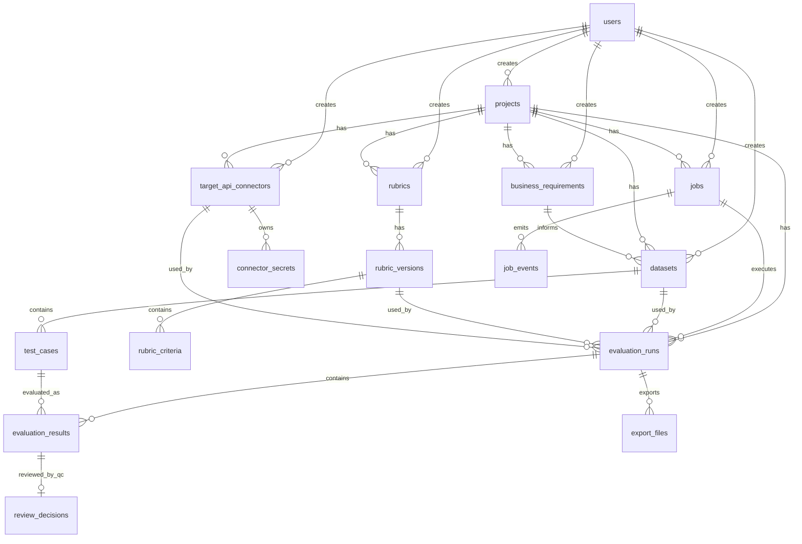

# 09. Database Schema MVP — VSF QC Copilot

> Implementation schema for the Week 3–4 MVP.  
> Use this document when writing Flyway migrations, JPA entities, repositories, API mappings, and response DTOs.

---

## 1. Schema Goals

The database must support this MVP flow:

```text
Login
→ Project
→ Dynamic Target API Connector
→ Requirement
→ Dataset / Test Cases
→ Rubric / Criteria
→ Evaluation Run / Job
→ Evaluation Results
→ QC Review Decision
→ Export Files
```

Design priorities:

```text
Clear relationships
Easy to implement in 2 weeks
Durable state in PostgreSQL
JSONB for dynamic connector/test metadata
Flexible enough for future API formats
Safe handling of API secrets
Stable public IDs for REST APIs
```

---

## 2. Database Conventions

### 2.1 Internal ID and Public ID

Use `BIGINT` as the internal database primary key.

```sql
id BIGINT GENERATED BY DEFAULT AS IDENTITY PRIMARY KEY
```

Use `UUID public_id` as the public identifier exposed through API URLs and responses.

```sql
public_id UUID NOT NULL DEFAULT gen_random_uuid()
```

Every main table should include a unique `public_id`:

```sql
CONSTRAINT uk_<table_name>_public_id UNIQUE (public_id)
```

Enable PostgreSQL UUID generation:

```sql
CREATE EXTENSION IF NOT EXISTS pgcrypto;
```

Rules:

```text
Internal DB relations use BIGINT id.
REST URLs and API responses use publicId.
Do not expose internal id in normal API responses.
Do not accept internal id from clients.
```

Example API URL:

```http
GET /api/v1/projects/{projectPublicId}/target-api-connectors/{connectorPublicId}
```

Example response field:

```json
{
  "publicId": "5ef3a8d2-05c2-4d0c-8f7b-3d4892ff64e1"
}
```

---

### 2.2 Foreign Keys

Foreign keys must use internal `BIGINT id` values.

Example:

```sql
project_id BIGINT NOT NULL REFERENCES projects(id)
created_by BIGINT NOT NULL REFERENCES users(id)
```

Application mapping rule:

```text
Controller receives publicId.
Service resolves publicId to internal id.
Repository queries and joins using BIGINT id.
DTO response returns publicId.
```

---

### 2.3 Timestamps

Use `TIMESTAMPTZ`:

```sql
created_at TIMESTAMPTZ NOT NULL DEFAULT now()
updated_at TIMESTAMPTZ NOT NULL DEFAULT now()
```

Application should update `updated_at` on write.

Recommended Java type:

```text
Instant or OffsetDateTime
```

---

### 2.4 JSON Fields

Use `JSONB` for dynamic payloads:

```text
headers_json
query_params_json
path_params_json
body_template_json
auth_config_json
secret_refs_json
metadata_json
payload_json
raw_*_json
```

Rules:

```text
JSONB is used for flexible connector/test metadata.
Do not store raw secret values inside headers_json or body_template_json.
Do not log JSON fields that may contain sensitive request/response data.
```

---

### 2.5 Soft Delete / Archive

For MVP, prefer statuses over hard delete for important records:

```text
projects.status = ACTIVE / ARCHIVED
datasets.status = DRAFT / APPROVED / ARCHIVED
test_cases.status = ACTIVE / INACTIVE
rubric_versions.status = DRAFT / PUBLISHED / ARCHIVED
target_api_connectors.active = true / false
```

---

### 2.6 Naming

Use snake_case table and column names.

Examples:

```text
target_api_connectors
connector_secrets
business_requirements
evaluation_runs
review_decisions
created_at
updated_at
public_id
```

Java/API naming convention:

```text
Database column: public_id
Java field: publicId
JSON field: publicId
```

---

## 3. Enum Values

Enums can be implemented as PostgreSQL enum types or as `VARCHAR` columns with application validation.

For MVP speed, `VARCHAR(50)` + application enum validation is acceptable.

### 3.1 User Status

```text
ACTIVE
DISABLED
```

### 3.2 Project Status

```text
ACTIVE
ARCHIVED
```

### 3.3 Requirement Status

```text
ACTIVE
ARCHIVED
```

### 3.4 Dataset Source Type

```text
MANUAL
IMPORTED_EXCEL
SAMPLE_DEMO
GENERATED
```

### 3.5 Dataset Status

```text
DRAFT
APPROVED
ARCHIVED
```

### 3.6 Test Case Status

```text
ACTIVE
INACTIVE
```

### 3.7 Rubric Version Status

```text
DRAFT
PUBLISHED
ARCHIVED
```

### 3.8 Job Type

```text
DATASET_GENERATION
EVALUATION_RUN
EXPORT_EXCEL
EXPORT_JSON
CONNECTOR_TEST
```

### 3.9 Job Status

```text
PENDING
RUNNING
COMPLETED
FAILED
CANCELLED
```

### 3.10 Evaluation Run Status

```text
PENDING
RUNNING
COMPLETED
FAILED
CANCELLED
```

### 3.11 Judge Status

```text
PASS
FAIL
WARNING
ERROR
```

### 3.12 QC Final Status

```text
NOT_REVIEWED
PASS
FAIL
NEED_FIX
IGNORED
```

### 3.13 Export File Type

```text
EXCEL
JSON
```

### 3.14 Export File Status

```text
PENDING
READY
FAILED
EXPIRED
```

### 3.15 Connector Protocol

```text
HTTP
GRAPHQL
```

MVP should implement `HTTP` first.

### 3.16 Connector Body Type

```text
NONE
RAW_JSON
RAW_TEXT
FORM_DATA
X_WWW_FORM_URLENCODED
GRAPHQL
```

MVP should implement `RAW_JSON` first.

### 3.17 Connector Auth Type

```text
NONE
BEARER
API_KEY
BASIC
CUSTOM_HEADER
```

### 3.18 Connector Response Format

```text
JSON
TEXT
SSE
```

MVP should implement `JSON` first.

### 3.19 Streaming Type

```text
SSE
CHUNKED
```

---

## 4. Entity Relationship Overview



---

## 5. Tables

## 5.1 `users`

Stores simple MVP users.

| Column | Type | Required | Notes |
|---|---|---|---|
| id | BIGINT | Yes | Internal PK |
| public_id | UUID | Yes | Public API ID, unique |
| username | VARCHAR(100) | Yes | Unique |
| password_hash | VARCHAR(255) | Yes | BCrypt or equivalent |
| display_name | VARCHAR(255) | Yes | UI display |
| status | VARCHAR(50) | Yes | ACTIVE / DISABLED |
| last_login_at | TIMESTAMPTZ | No | Updated on login |
| created_at | TIMESTAMPTZ | Yes | Default now |
| updated_at | TIMESTAMPTZ | Yes | Default now |

Indexes / constraints:

```sql
CONSTRAINT uk_users_public_id UNIQUE (public_id);
CONSTRAINT uk_users_username UNIQUE (username);
CREATE INDEX idx_users_status ON users(status);
```

SQL draft:

```sql
CREATE TABLE users (
    id BIGINT GENERATED BY DEFAULT AS IDENTITY PRIMARY KEY,
    public_id UUID NOT NULL DEFAULT gen_random_uuid(),
    username VARCHAR(100) NOT NULL,
    password_hash VARCHAR(255) NOT NULL,
    display_name VARCHAR(255) NOT NULL,
    status VARCHAR(50) NOT NULL DEFAULT 'ACTIVE',
    last_login_at TIMESTAMPTZ,
    created_at TIMESTAMPTZ NOT NULL DEFAULT now(),
    updated_at TIMESTAMPTZ NOT NULL DEFAULT now(),
    CONSTRAINT uk_users_public_id UNIQUE (public_id),
    CONSTRAINT uk_users_username UNIQUE (username)
);
```

---

## 5.2 `projects`

Represents an evaluation scope.

| Column | Type | Required | Notes |
|---|---|---|---|
| id | BIGINT | Yes | Internal PK |
| public_id | UUID | Yes | Public API ID, unique |
| name | VARCHAR(255) | Yes | Project name |
| description | TEXT | No | Project description |
| evaluation_scope | TEXT | No | What this project evaluates |
| retention_days | INTEGER | No | Default 30 |
| status | VARCHAR(50) | Yes | ACTIVE / ARCHIVED |
| created_by | BIGINT | Yes | FK users.id |
| archived_at | TIMESTAMPTZ | No | Set when archived |
| created_at | TIMESTAMPTZ | Yes | Default now |
| updated_at | TIMESTAMPTZ | Yes | Default now |

Indexes / constraints:

```sql
CONSTRAINT uk_projects_public_id UNIQUE (public_id);
CREATE INDEX idx_projects_created_by ON projects(created_by);
CREATE INDEX idx_projects_status ON projects(status);
```

---

## 5.3 `target_api_connectors`

Stores the target API configuration that VSF QC Copilot will call during evaluation.

This table replaces the old `api_connectors` name. The new name is more explicit because the connector points to the target chatbot/API being tested, not the platform API itself.

The connector should store a request configuration similar to a minimal Postman request:

```text
method
url / base_url / path
headers
query params
path params
body
auth
response selector
timeout
retry
```

| Column | Type | Required | Notes |
|---|---|---|---|
| id | BIGINT | Yes | Internal PK |
| public_id | UUID | Yes | Public API ID, unique |
| project_id | BIGINT | Yes | FK projects.id |
| name | VARCHAR(255) | Yes | Connector name |
| description | TEXT | No | Description |
| raw_curl | TEXT | No | Original cURL if provided |
| protocol | VARCHAR(50) | Yes | HTTP / GRAPHQL. Default HTTP |
| method | VARCHAR(20) | Yes | GET / POST / PUT / PATCH / DELETE |
| base_url | TEXT | No | Example: https://api.example.com |
| path | TEXT | No | Example: /v1/chat/completions |
| url | TEXT | Yes | Full target URL for MVP execution |
| headers_json | JSONB | No | Header template only. Do not store raw secrets |
| query_params_json | JSONB | No | Query parameter template |
| path_params_json | JSONB | No | Dynamic path params |
| body_type | VARCHAR(50) | Yes | NONE / RAW_JSON / RAW_TEXT / etc. |
| body_template_json | JSONB | No | JSON body template |
| body_template_text | TEXT | No | Raw text body template if not JSON |
| auth_type | VARCHAR(50) | Yes | NONE / BEARER / API_KEY / BASIC / CUSTOM_HEADER |
| auth_config_json | JSONB | No | Masked auth config / placement metadata |
| secret_refs_json | JSONB | No | References to connector_secrets keys |
| is_streaming | BOOLEAN | Yes | Default false |
| streaming_type | VARCHAR(50) | No | SSE / CHUNKED / null |
| streaming_event_selector | VARCHAR(255) | No | Selector for streaming payload if needed |
| response_selector | VARCHAR(255) | Yes | Example: $.answer or $.choices[0].message.content |
| response_format | VARCHAR(50) | Yes | JSON / TEXT / SSE. Default JSON |
| timeout_seconds | INTEGER | Yes | Default 60 |
| retry_count | INTEGER | Yes | Default 1 |
| active | BOOLEAN | Yes | Default true |
| created_by | BIGINT | Yes | FK users.id |
| created_at | TIMESTAMPTZ | Yes | Default now |
| updated_at | TIMESTAMPTZ | Yes | Default now |

Indexes / constraints:

```sql
CONSTRAINT uk_target_api_connectors_public_id UNIQUE (public_id);
CREATE INDEX idx_target_api_connectors_project_id ON target_api_connectors(project_id);
CREATE INDEX idx_target_api_connectors_active ON target_api_connectors(active);
CREATE INDEX idx_target_api_connectors_created_by ON target_api_connectors(created_by);
```

Secret rules:

```text
Do not store raw tokens in headers_json.
Do not store raw tokens in body_template_json.
Do not return raw tokens in API responses.
Do not log raw request headers/body after template rendering.
Use connector_secrets for encrypted secret values.
```

Example safe `headers_json`:

```json
{
  "Authorization": "Bearer {{secret:CHATBOT_API_TOKEN}}",
  "Content-Type": "application/json"
}
```

Example `secret_refs_json`:

```json
{
  "CHATBOT_API_TOKEN": {
    "usage": "header",
    "headerName": "Authorization",
    "mask": "ogw_live_****abcd"
  }
}
```

SQL draft:

```sql
CREATE TABLE target_api_connectors (
    id BIGINT GENERATED BY DEFAULT AS IDENTITY PRIMARY KEY,
    public_id UUID NOT NULL DEFAULT gen_random_uuid(),
    project_id BIGINT NOT NULL REFERENCES projects(id),
    name VARCHAR(255) NOT NULL,
    description TEXT,
    raw_curl TEXT,
    protocol VARCHAR(50) NOT NULL DEFAULT 'HTTP',
    method VARCHAR(20) NOT NULL,
    base_url TEXT,
    path TEXT,
    url TEXT NOT NULL,
    headers_json JSONB,
    query_params_json JSONB,
    path_params_json JSONB,
    body_type VARCHAR(50) NOT NULL DEFAULT 'RAW_JSON',
    body_template_json JSONB,
    body_template_text TEXT,
    auth_type VARCHAR(50) NOT NULL DEFAULT 'NONE',
    auth_config_json JSONB,
    secret_refs_json JSONB,
    is_streaming BOOLEAN NOT NULL DEFAULT false,
    streaming_type VARCHAR(50),
    streaming_event_selector VARCHAR(255),
    response_selector VARCHAR(255) NOT NULL DEFAULT '$.answer',
    response_format VARCHAR(50) NOT NULL DEFAULT 'JSON',
    timeout_seconds INTEGER NOT NULL DEFAULT 60,
    retry_count INTEGER NOT NULL DEFAULT 1,
    active BOOLEAN NOT NULL DEFAULT true,
    created_by BIGINT NOT NULL REFERENCES users(id),
    created_at TIMESTAMPTZ NOT NULL DEFAULT now(),
    updated_at TIMESTAMPTZ NOT NULL DEFAULT now(),
    CONSTRAINT uk_target_api_connectors_public_id UNIQUE (public_id)
);
```

---

## 5.4 `connector_secrets`

Stores encrypted secret values for target API connectors.

This table prevents raw secrets from being stored directly inside `headers_json`, `body_template_json`, or `auth_config_json`.

| Column | Type | Required | Notes |
|---|---|---|---|
| id | BIGINT | Yes | Internal PK |
| public_id | UUID | Yes | Public API ID, unique |
| connector_id | BIGINT | Yes | FK target_api_connectors.id |
| secret_key | VARCHAR(100) | Yes | Logical key, e.g. CHATBOT_API_TOKEN |
| encrypted_value | TEXT | Yes | Encrypted secret value |
| masked_value | VARCHAR(255) | No | Safe display value, e.g. ogw_live_****abcd |
| description | TEXT | No | Optional secret description |
| created_by | BIGINT | Yes | FK users.id |
| created_at | TIMESTAMPTZ | Yes | Default now |
| updated_at | TIMESTAMPTZ | Yes | Default now |

Indexes / constraints:

```sql
CONSTRAINT uk_connector_secrets_public_id UNIQUE (public_id);
CONSTRAINT uk_connector_secrets_connector_key UNIQUE (connector_id, secret_key);
CREATE INDEX idx_connector_secrets_connector_id ON connector_secrets(connector_id);
```

Rules:

```text
encrypted_value must never be returned in API response.
masked_value can be returned in API response.
secret_key is referenced by {{secret:SECRET_KEY}} placeholders.
Deleting a connector should delete or disable its secrets depending on product policy.
```

SQL draft:

```sql
CREATE TABLE connector_secrets (
    id BIGINT GENERATED BY DEFAULT AS IDENTITY PRIMARY KEY,
    public_id UUID NOT NULL DEFAULT gen_random_uuid(),
    connector_id BIGINT NOT NULL REFERENCES target_api_connectors(id),
    secret_key VARCHAR(100) NOT NULL,
    encrypted_value TEXT NOT NULL,
    masked_value VARCHAR(255),
    description TEXT,
    created_by BIGINT NOT NULL REFERENCES users(id),
    created_at TIMESTAMPTZ NOT NULL DEFAULT now(),
    updated_at TIMESTAMPTZ NOT NULL DEFAULT now(),
    CONSTRAINT uk_connector_secrets_public_id UNIQUE (public_id),
    CONSTRAINT uk_connector_secrets_connector_key UNIQUE (connector_id, secret_key)
);
```

---

## 5.5 `business_requirements`

Stores free-text business requirements.

| Column | Type | Required | Notes |
|---|---|---|---|
| id | BIGINT | Yes | Internal PK |
| public_id | UUID | Yes | Public API ID, unique |
| project_id | BIGINT | Yes | FK projects.id |
| content | TEXT | Yes | Requirement content |
| version | INTEGER | Yes | Starts at 1 |
| status | VARCHAR(50) | Yes | ACTIVE / ARCHIVED |
| created_by | BIGINT | Yes | FK users.id |
| created_at | TIMESTAMPTZ | Yes | Default now |
| updated_at | TIMESTAMPTZ | Yes | Default now |

Indexes / constraints:

```sql
CONSTRAINT uk_business_requirements_public_id UNIQUE (public_id);
CREATE INDEX idx_requirements_project_id ON business_requirements(project_id);
CREATE INDEX idx_requirements_status ON business_requirements(status);
```

---

## 5.6 `datasets`

Stores dataset versions.

| Column | Type | Required | Notes |
|---|---|---|---|
| id | BIGINT | Yes | Internal PK |
| public_id | UUID | Yes | Public API ID, unique |
| project_id | BIGINT | Yes | FK projects.id |
| requirement_id | BIGINT | No | FK business_requirements.id |
| name | VARCHAR(255) | Yes | Dataset name |
| description | TEXT | No | Description |
| version | INTEGER | Yes | Starts at 1 |
| source_type | VARCHAR(50) | Yes | MANUAL / IMPORTED_EXCEL / SAMPLE_DEMO / GENERATED |
| status | VARCHAR(50) | Yes | DRAFT / APPROVED / ARCHIVED |
| created_by | BIGINT | Yes | FK users.id |
| approved_by | BIGINT | No | FK users.id |
| approved_at | TIMESTAMPTZ | No | Set when approved |
| created_at | TIMESTAMPTZ | Yes | Default now |
| updated_at | TIMESTAMPTZ | Yes | Default now |

Indexes / constraints:

```sql
CONSTRAINT uk_datasets_public_id UNIQUE (public_id);
CREATE INDEX idx_datasets_project_id ON datasets(project_id);
CREATE INDEX idx_datasets_requirement_id ON datasets(requirement_id);
CREATE INDEX idx_datasets_status ON datasets(status);
```

Rule:

```text
Only APPROVED datasets should be used for official evaluation runs.
```

---

## 5.7 `test_cases`

Stores individual test cases.

| Column | Type | Required | Notes |
|---|---|---|---|
| id | BIGINT | Yes | Internal PK |
| public_id | UUID | Yes | Public API ID, unique |
| dataset_id | BIGINT | Yes | FK datasets.id |
| external_id | VARCHAR(255) | No | Excel/source row ID |
| question | TEXT | Yes | User question/input |
| precondition | JSONB | No | Context/precondition |
| ground_truth | TEXT | No | Expected answer |
| metadata_json | JSONB | No | userId/date/expectedStatus/etc. |
| status | VARCHAR(50) | Yes | ACTIVE / INACTIVE |
| sort_order | INTEGER | No | Stable display order |
| created_at | TIMESTAMPTZ | Yes | Default now |
| updated_at | TIMESTAMPTZ | Yes | Default now |

Indexes / constraints:

```sql
CONSTRAINT uk_test_cases_public_id UNIQUE (public_id);
CREATE INDEX idx_test_cases_dataset_id ON test_cases(dataset_id);
CREATE INDEX idx_test_cases_status ON test_cases(status);
CREATE INDEX idx_test_cases_external_id ON test_cases(external_id);
```

MVP limit:

```text
Warn or reject official evaluation if active test cases >= 100.
Recommended demo size: 30–80 cases.
```

---

## 5.8 `rubrics`

Stores rubric identity.

| Column | Type | Required | Notes |
|---|---|---|---|
| id | BIGINT | Yes | Internal PK |
| public_id | UUID | Yes | Public API ID, unique |
| project_id | BIGINT | Yes | FK projects.id |
| name | VARCHAR(255) | Yes | Rubric name |
| description | TEXT | No | Description |
| current_version | INTEGER | No | Current published version number |
| created_by | BIGINT | Yes | FK users.id |
| created_at | TIMESTAMPTZ | Yes | Default now |
| updated_at | TIMESTAMPTZ | Yes | Default now |

Indexes / constraints:

```sql
CONSTRAINT uk_rubrics_public_id UNIQUE (public_id);
CREATE INDEX idx_rubrics_project_id ON rubrics(project_id);
```

---

## 5.9 `rubric_versions`

Stores versioned rubric snapshots.

| Column | Type | Required | Notes |
|---|---|---|---|
| id | BIGINT | Yes | Internal PK |
| public_id | UUID | Yes | Public API ID, unique |
| rubric_id | BIGINT | Yes | FK rubrics.id |
| version | INTEGER | Yes | Version number |
| status | VARCHAR(50) | Yes | DRAFT / PUBLISHED / ARCHIVED |
| created_by | BIGINT | Yes | FK users.id |
| created_at | TIMESTAMPTZ | Yes | Default now |
| published_at | TIMESTAMPTZ | No | Set when published |

Indexes / constraints:

```sql
CONSTRAINT uk_rubric_versions_public_id UNIQUE (public_id);
CREATE INDEX idx_rubric_versions_rubric_id ON rubric_versions(rubric_id);
CREATE UNIQUE INDEX uk_rubric_versions_rubric_version ON rubric_versions(rubric_id, version);
```

---

## 5.10 `rubric_criteria`

Stores dynamic criteria for judge evaluation.

| Column | Type | Required | Notes |
|---|---|---|---|
| id | BIGINT | Yes | Internal PK |
| public_id | UUID | Yes | Public API ID, unique |
| rubric_version_id | BIGINT | Yes | FK rubric_versions.id |
| name | VARCHAR(255) | Yes | Criterion name |
| description | TEXT | No | Criterion description |
| weight | NUMERIC(5,4) | Yes | Example: 0.4000 |
| pass_condition | TEXT | No | What counts as pass |
| fail_condition | TEXT | No | What counts as fail |
| judge_instruction | TEXT | Yes | Instruction for LLM judge |
| metric_key | VARCHAR(100) | Yes | Stable key, e.g. correctness |
| is_critical | BOOLEAN | Yes | Default false |
| sort_order | INTEGER | Yes | Display/evaluation order |
| created_at | TIMESTAMPTZ | Yes | Default now |
| updated_at | TIMESTAMPTZ | Yes | Default now |

Indexes / constraints:

```sql
CONSTRAINT uk_rubric_criteria_public_id UNIQUE (public_id);
CREATE INDEX idx_rubric_criteria_version_id ON rubric_criteria(rubric_version_id);
CREATE INDEX idx_rubric_criteria_metric_key ON rubric_criteria(metric_key);
```

---

## 5.11 `jobs`

Stores async job state.

| Column | Type | Required | Notes |
|---|---|---|---|
| id | BIGINT | Yes | Internal PK |
| public_id | UUID | Yes | Public API ID, unique |
| job_type | VARCHAR(50) | Yes | EVALUATION_RUN / EXPORT_EXCEL / etc. |
| status | VARCHAR(50) | Yes | PENDING / RUNNING / COMPLETED / FAILED / CANCELLED |
| resource_type | VARCHAR(50) | Yes | EVALUATION_RUN / EXPORT_FILE / etc. |
| resource_id | BIGINT | Yes | Internal id of related resource |
| project_id | BIGINT | No | FK projects.id |
| created_by | BIGINT | Yes | FK users.id |
| progress_current | INTEGER | Yes | Default 0 |
| progress_total | INTEGER | Yes | Default 0 |
| error_message | TEXT | No | Short readable error |
| retry_count | INTEGER | Yes | Default 0 |
| max_retries | INTEGER | Yes | Default 0 or 1 |
| created_at | TIMESTAMPTZ | Yes | Default now |
| started_at | TIMESTAMPTZ | No | When worker starts |
| completed_at | TIMESTAMPTZ | No | When done |
| updated_at | TIMESTAMPTZ | Yes | Default now |

Indexes / constraints:

```sql
CONSTRAINT uk_jobs_public_id UNIQUE (public_id);
CREATE INDEX idx_jobs_status ON jobs(status);
CREATE INDEX idx_jobs_type_status ON jobs(job_type, status);
CREATE INDEX idx_jobs_project_id ON jobs(project_id);
```

---

## 5.12 `job_events`

Stores job progress events.

| Column | Type | Required | Notes |
|---|---|---|---|
| id | BIGINT | Yes | Internal PK |
| public_id | UUID | Yes | Public API ID, unique |
| job_id | BIGINT | Yes | FK jobs.id |
| event_type | VARCHAR(100) | Yes | CASE_COMPLETED / ERROR / etc. |
| payload_json | JSONB | No | Event data |
| created_at | TIMESTAMPTZ | Yes | Default now |

Indexes / constraints:

```sql
CONSTRAINT uk_job_events_public_id UNIQUE (public_id);
CREATE INDEX idx_job_events_job_id ON job_events(job_id);
CREATE INDEX idx_job_events_created_at ON job_events(created_at);
```

---

## 5.13 `evaluation_runs`

Stores one evaluation execution.

| Column | Type | Required | Notes |
|---|---|---|---|
| id | BIGINT | Yes | Internal PK |
| public_id | UUID | Yes | Public API ID, unique |
| project_id | BIGINT | Yes | FK projects.id |
| dataset_id | BIGINT | Yes | FK datasets.id |
| rubric_version_id | BIGINT | Yes | FK rubric_versions.id |
| target_api_connector_id | BIGINT | Yes | FK target_api_connectors.id |
| job_id | BIGINT | No | FK jobs.id |
| status | VARCHAR(50) | Yes | PENDING / RUNNING / COMPLETED / FAILED / CANCELLED |
| total_cases | INTEGER | Yes | Default 0 |
| passed_cases | INTEGER | Yes | Default 0 |
| failed_cases | INTEGER | Yes | Default 0 |
| warning_cases | INTEGER | Yes | Default 0 |
| error_cases | INTEGER | Yes | Default 0 |
| pass_rate | NUMERIC(6,4) | No | 0.0000 to 1.0000 |
| max_concurrency | INTEGER | No | Default 1 or 3 |
| created_by | BIGINT | Yes | FK users.id |
| started_at | TIMESTAMPTZ | No | When worker starts |
| completed_at | TIMESTAMPTZ | No | When done |
| created_at | TIMESTAMPTZ | Yes | Default now |
| updated_at | TIMESTAMPTZ | Yes | Default now |

Indexes / constraints:

```sql
CONSTRAINT uk_evaluation_runs_public_id UNIQUE (public_id);
CREATE INDEX idx_evaluation_runs_project_id ON evaluation_runs(project_id);
CREATE INDEX idx_evaluation_runs_status ON evaluation_runs(status);
CREATE INDEX idx_evaluation_runs_created_at ON evaluation_runs(created_at);
CREATE INDEX idx_evaluation_runs_connector_id ON evaluation_runs(target_api_connector_id);
```

---

## 5.14 `evaluation_results`

Stores per-test-case result.

| Column | Type | Required | Notes |
|---|---|---|---|
| id | BIGINT | Yes | Internal PK |
| public_id | UUID | Yes | Public API ID, unique |
| evaluation_run_id | BIGINT | Yes | FK evaluation_runs.id |
| test_case_id | BIGINT | Yes | FK test_cases.id |
| actual_answer | TEXT | No | Answer extracted from target API |
| raw_target_response_json | JSONB | No | Safe raw response |
| judge_score | NUMERIC(6,4) | No | 0.0000 to 1.0000 |
| judge_status | VARCHAR(50) | Yes | PASS / FAIL / WARNING / ERROR |
| judge_reason | TEXT | No | Explanation |
| criteria_results_json | JSONB | No | Per-criterion result |
| raw_promptfoo_result_json | JSONB | No | Raw promptfoo row if safe |
| latency_ms | INTEGER | No | Target/judge latency |
| token_usage_json | JSONB | No | Token usage if provider returns it |
| error_message | TEXT | No | Error detail if failed |
| created_at | TIMESTAMPTZ | Yes | Default now |

Indexes / constraints:

```sql
CONSTRAINT uk_evaluation_results_public_id UNIQUE (public_id);
CREATE INDEX idx_evaluation_results_run_id ON evaluation_results(evaluation_run_id);
CREATE INDEX idx_evaluation_results_test_case_id ON evaluation_results(test_case_id);
CREATE INDEX idx_evaluation_results_judge_status ON evaluation_results(judge_status);
CREATE UNIQUE INDEX uk_evaluation_result_run_case ON evaluation_results(evaluation_run_id, test_case_id);
```

---

## 5.15 `review_decisions`

Stores QC final decision for a result.

| Column | Type | Required | Notes |
|---|---|---|---|
| id | BIGINT | Yes | Internal PK |
| public_id | UUID | Yes | Public API ID, unique |
| evaluation_result_id | BIGINT | Yes | FK evaluation_results.id |
| qc_status | VARCHAR(50) | Yes | NOT_REVIEWED / PASS / FAIL / NEED_FIX / IGNORED |
| qc_note | TEXT | No | QC note |
| pic_bug | VARCHAR(255) | No | Person in charge / bug owner |
| reviewed_by | BIGINT | Yes | FK users.id |
| reviewed_at | TIMESTAMPTZ | Yes | When reviewed |
| updated_at | TIMESTAMPTZ | Yes | Default now |

Indexes / constraints:

```sql
CONSTRAINT uk_review_decisions_public_id UNIQUE (public_id);
CREATE UNIQUE INDEX uk_review_decisions_result_id ON review_decisions(evaluation_result_id);
CREATE INDEX idx_review_decisions_qc_status ON review_decisions(qc_status);
```

Rule:

```text
A result can have at most one current review decision.
Use PUT for upsert behavior.
```

---

## 5.16 `export_files`

Stores export file metadata.

| Column | Type | Required | Notes |
|---|---|---|---|
| id | BIGINT | Yes | Internal PK |
| public_id | UUID | Yes | Public API ID, unique |
| project_id | BIGINT | Yes | FK projects.id |
| evaluation_run_id | BIGINT | Yes | FK evaluation_runs.id |
| job_id | BIGINT | No | FK jobs.id |
| file_type | VARCHAR(50) | Yes | EXCEL / JSON |
| status | VARCHAR(50) | Yes | PENDING / READY / FAILED / EXPIRED |
| file_path | TEXT | No | Server path |
| file_name | VARCHAR(255) | No | Download name |
| error_message | TEXT | No | Failure reason |
| created_by | BIGINT | Yes | FK users.id |
| created_at | TIMESTAMPTZ | Yes | Default now |
| ready_at | TIMESTAMPTZ | No | When file is ready |

Indexes / constraints:

```sql
CONSTRAINT uk_export_files_public_id UNIQUE (public_id);
CREATE INDEX idx_export_files_run_id ON export_files(evaluation_run_id);
CREATE INDEX idx_export_files_status ON export_files(status);
CREATE INDEX idx_export_files_project_id ON export_files(project_id);
```

---

## 6. API Mapping Rules

### 6.1 URL Mapping

Use `publicId` in API paths.

```http
GET /api/v1/projects/{projectPublicId}
GET /api/v1/projects/{projectPublicId}/target-api-connectors/{connectorPublicId}
GET /api/v1/projects/{projectPublicId}/datasets/{datasetPublicId}
GET /api/v1/projects/{projectPublicId}/evaluation-runs/{runPublicId}
```

Do not expose internal `id` in normal DTO responses.

Recommended response shape:

```json
{
  "publicId": "5ef3a8d2-05c2-4d0c-8f7b-3d4892ff64e1",
  "name": "Mock Health Chatbot",
  "createdAt": "2026-06-09T08:00:00Z",
  "updatedAt": "2026-06-09T08:00:00Z"
}
```

---

### 6.2 Service Mapping

Recommended service flow:

```text
1. Controller receives publicId from URL.
2. Service finds entity by public_id.
3. Service uses internal id for FK writes and joins.
4. Mapper converts entity.publicId to DTO.publicId.
5. Internal id stays inside backend only.
```

Repository examples:

```java
Optional<Project> findByPublicId(UUID publicId);
Optional<TargetApiConnector> findByPublicIdAndProjectId(UUID publicId, Long projectId);
```

---

### 6.3 Connector Request Rendering

At runtime, `target_api_connectors` should be rendered into an HTTP request:

```text
1. Load connector by publicId.
2. Load connector_secrets by connector_id.
3. Replace {{secret:KEY}} placeholders in headers/body/auth config.
4. Replace dataset/test-case variables in body_template_json or body_template_text.
5. Send HTTP request to target API.
6. Extract answer using response_selector.
7. Store safe result in evaluation_results.
```

Never persist or log the fully rendered request if it contains secrets.

---

## 7. Migration Order

Recommended Flyway migration order:

```text
V1__enable_extensions.sql
V2__create_users.sql
V3__create_projects.sql
V4__create_target_api_connectors.sql
V5__create_connector_secrets.sql
V6__create_requirements_datasets_test_cases.sql
V7__create_rubrics.sql
V8__create_jobs.sql
V9__create_evaluation_runs_results_reviews.sql
V10__create_export_files.sql
V11__seed_demo_user.sql
```

For faster MVP, these can be combined into one migration:

```text
V1__init_schema.sql
V2__seed_demo_data.sql
```

---

## 8. Seed Data

### 8.1 Demo User

Seed only in local/demo profile:

```text
username: qc_demo
password: password123
```

Password must be stored as hash.

### 8.2 Optional Demo Project

```text
name: AI Health Chatbot Demo
status: ACTIVE
```

### 8.3 Optional Mock Target API Connector

```text
name: Mock Health Chatbot
method: POST
url: http://localhost:8080/mock-chatbot/chat
response_selector: $.answer
```

Safe header template:

```json
{
  "Authorization": "Bearer {{secret:CHATBOT_API_TOKEN}}",
  "Content-Type": "application/json"
}
```

Connector secret:

```text
secret_key: CHATBOT_API_TOKEN
masked_value: demo_****token
encrypted_value: encrypted demo token value
```

### 8.4 Optional Rubric

Suggested criteria:

```text
Correctness
Completeness
Clarity
Safety / No hallucination
```

---

## 9. Important Business Rules

### 9.1 Public ID Rule

```text
Only public_id is exposed through REST APIs.
Internal BIGINT id is used only inside database/service layer.
```

### 9.2 Dataset Approval

```text
Only APPROVED datasets should be used for official evaluation runs.
```

### 9.3 MVP Case Limit

```text
Evaluation run should warn or reject when active test cases >= 100.
Recommended demo size: 30–80 cases.
```

### 9.4 Connector Safety

```text
Do not expose full secret values in API response.
Do not log Authorization or API key values.
Do not store raw token values in headers_json.
Do not store raw token values in body_template_json.
Use connector_secrets for encrypted secret values.
```

### 9.5 QC Override

```text
judge_status is automated.
qc_status is human final decision.
Do not overwrite judge_status when QC reviews a result.
```

### 9.6 Export Flexibility

```text
Export should not fail because optional fields are missing.
Fill mapped fields and leave unavailable fields blank.
```

---

## 10. Minimal SQL Skeleton

This is not the full production migration, but it shows the expected style.

```sql
CREATE EXTENSION IF NOT EXISTS pgcrypto;

CREATE TABLE users (
    id BIGINT GENERATED BY DEFAULT AS IDENTITY PRIMARY KEY,
    public_id UUID NOT NULL DEFAULT gen_random_uuid(),
    username VARCHAR(100) NOT NULL,
    password_hash VARCHAR(255) NOT NULL,
    display_name VARCHAR(255) NOT NULL,
    status VARCHAR(50) NOT NULL DEFAULT 'ACTIVE',
    last_login_at TIMESTAMPTZ,
    created_at TIMESTAMPTZ NOT NULL DEFAULT now(),
    updated_at TIMESTAMPTZ NOT NULL DEFAULT now(),
    CONSTRAINT uk_users_public_id UNIQUE (public_id),
    CONSTRAINT uk_users_username UNIQUE (username)
);

CREATE TABLE projects (
    id BIGINT GENERATED BY DEFAULT AS IDENTITY PRIMARY KEY,
    public_id UUID NOT NULL DEFAULT gen_random_uuid(),
    name VARCHAR(255) NOT NULL,
    description TEXT,
    evaluation_scope TEXT,
    retention_days INTEGER DEFAULT 30,
    status VARCHAR(50) NOT NULL DEFAULT 'ACTIVE',
    created_by BIGINT NOT NULL REFERENCES users(id),
    archived_at TIMESTAMPTZ,
    created_at TIMESTAMPTZ NOT NULL DEFAULT now(),
    updated_at TIMESTAMPTZ NOT NULL DEFAULT now(),
    CONSTRAINT uk_projects_public_id UNIQUE (public_id)
);

CREATE TABLE target_api_connectors (
    id BIGINT GENERATED BY DEFAULT AS IDENTITY PRIMARY KEY,
    public_id UUID NOT NULL DEFAULT gen_random_uuid(),
    project_id BIGINT NOT NULL REFERENCES projects(id),
    name VARCHAR(255) NOT NULL,
    description TEXT,
    raw_curl TEXT,
    protocol VARCHAR(50) NOT NULL DEFAULT 'HTTP',
    method VARCHAR(20) NOT NULL,
    base_url TEXT,
    path TEXT,
    url TEXT NOT NULL,
    headers_json JSONB,
    query_params_json JSONB,
    path_params_json JSONB,
    body_type VARCHAR(50) NOT NULL DEFAULT 'RAW_JSON',
    body_template_json JSONB,
    body_template_text TEXT,
    auth_type VARCHAR(50) NOT NULL DEFAULT 'NONE',
    auth_config_json JSONB,
    secret_refs_json JSONB,
    is_streaming BOOLEAN NOT NULL DEFAULT false,
    streaming_type VARCHAR(50),
    streaming_event_selector VARCHAR(255),
    response_selector VARCHAR(255) NOT NULL DEFAULT '$.answer',
    response_format VARCHAR(50) NOT NULL DEFAULT 'JSON',
    timeout_seconds INTEGER NOT NULL DEFAULT 60,
    retry_count INTEGER NOT NULL DEFAULT 1,
    active BOOLEAN NOT NULL DEFAULT true,
    created_by BIGINT NOT NULL REFERENCES users(id),
    created_at TIMESTAMPTZ NOT NULL DEFAULT now(),
    updated_at TIMESTAMPTZ NOT NULL DEFAULT now(),
    CONSTRAINT uk_target_api_connectors_public_id UNIQUE (public_id)
);

CREATE TABLE connector_secrets (
    id BIGINT GENERATED BY DEFAULT AS IDENTITY PRIMARY KEY,
    public_id UUID NOT NULL DEFAULT gen_random_uuid(),
    connector_id BIGINT NOT NULL REFERENCES target_api_connectors(id),
    secret_key VARCHAR(100) NOT NULL,
    encrypted_value TEXT NOT NULL,
    masked_value VARCHAR(255),
    description TEXT,
    created_by BIGINT NOT NULL REFERENCES users(id),
    created_at TIMESTAMPTZ NOT NULL DEFAULT now(),
    updated_at TIMESTAMPTZ NOT NULL DEFAULT now(),
    CONSTRAINT uk_connector_secrets_public_id UNIQUE (public_id),
    CONSTRAINT uk_connector_secrets_connector_key UNIQUE (connector_id, secret_key)
);

CREATE TABLE business_requirements (
    id BIGINT GENERATED BY DEFAULT AS IDENTITY PRIMARY KEY,
    public_id UUID NOT NULL DEFAULT gen_random_uuid(),
    project_id BIGINT NOT NULL REFERENCES projects(id),
    content TEXT NOT NULL,
    version INTEGER NOT NULL DEFAULT 1,
    status VARCHAR(50) NOT NULL DEFAULT 'ACTIVE',
    created_by BIGINT NOT NULL REFERENCES users(id),
    created_at TIMESTAMPTZ NOT NULL DEFAULT now(),
    updated_at TIMESTAMPTZ NOT NULL DEFAULT now(),
    CONSTRAINT uk_business_requirements_public_id UNIQUE (public_id)
);

CREATE TABLE datasets (
    id BIGINT GENERATED BY DEFAULT AS IDENTITY PRIMARY KEY,
    public_id UUID NOT NULL DEFAULT gen_random_uuid(),
    project_id BIGINT NOT NULL REFERENCES projects(id),
    requirement_id BIGINT REFERENCES business_requirements(id),
    name VARCHAR(255) NOT NULL,
    description TEXT,
    version INTEGER NOT NULL DEFAULT 1,
    source_type VARCHAR(50) NOT NULL,
    status VARCHAR(50) NOT NULL DEFAULT 'DRAFT',
    created_by BIGINT NOT NULL REFERENCES users(id),
    approved_by BIGINT REFERENCES users(id),
    approved_at TIMESTAMPTZ,
    created_at TIMESTAMPTZ NOT NULL DEFAULT now(),
    updated_at TIMESTAMPTZ NOT NULL DEFAULT now(),
    CONSTRAINT uk_datasets_public_id UNIQUE (public_id)
);

CREATE TABLE test_cases (
    id BIGINT GENERATED BY DEFAULT AS IDENTITY PRIMARY KEY,
    public_id UUID NOT NULL DEFAULT gen_random_uuid(),
    dataset_id BIGINT NOT NULL REFERENCES datasets(id),
    external_id VARCHAR(255),
    question TEXT NOT NULL,
    precondition JSONB,
    ground_truth TEXT,
    metadata_json JSONB,
    status VARCHAR(50) NOT NULL DEFAULT 'ACTIVE',
    sort_order INTEGER,
    created_at TIMESTAMPTZ NOT NULL DEFAULT now(),
    updated_at TIMESTAMPTZ NOT NULL DEFAULT now(),
    CONSTRAINT uk_test_cases_public_id UNIQUE (public_id)
);

CREATE TABLE rubrics (
    id BIGINT GENERATED BY DEFAULT AS IDENTITY PRIMARY KEY,
    public_id UUID NOT NULL DEFAULT gen_random_uuid(),
    project_id BIGINT NOT NULL REFERENCES projects(id),
    name VARCHAR(255) NOT NULL,
    description TEXT,
    current_version INTEGER,
    created_by BIGINT NOT NULL REFERENCES users(id),
    created_at TIMESTAMPTZ NOT NULL DEFAULT now(),
    updated_at TIMESTAMPTZ NOT NULL DEFAULT now(),
    CONSTRAINT uk_rubrics_public_id UNIQUE (public_id)
);

CREATE TABLE rubric_versions (
    id BIGINT GENERATED BY DEFAULT AS IDENTITY PRIMARY KEY,
    public_id UUID NOT NULL DEFAULT gen_random_uuid(),
    rubric_id BIGINT NOT NULL REFERENCES rubrics(id),
    version INTEGER NOT NULL,
    status VARCHAR(50) NOT NULL DEFAULT 'DRAFT',
    created_by BIGINT NOT NULL REFERENCES users(id),
    created_at TIMESTAMPTZ NOT NULL DEFAULT now(),
    published_at TIMESTAMPTZ,
    CONSTRAINT uk_rubric_versions_public_id UNIQUE (public_id),
    CONSTRAINT uk_rubric_versions_rubric_version UNIQUE (rubric_id, version)
);

CREATE TABLE rubric_criteria (
    id BIGINT GENERATED BY DEFAULT AS IDENTITY PRIMARY KEY,
    public_id UUID NOT NULL DEFAULT gen_random_uuid(),
    rubric_version_id BIGINT NOT NULL REFERENCES rubric_versions(id),
    name VARCHAR(255) NOT NULL,
    description TEXT,
    weight NUMERIC(5,4) NOT NULL,
    pass_condition TEXT,
    fail_condition TEXT,
    judge_instruction TEXT NOT NULL,
    metric_key VARCHAR(100) NOT NULL,
    is_critical BOOLEAN NOT NULL DEFAULT false,
    sort_order INTEGER NOT NULL DEFAULT 0,
    created_at TIMESTAMPTZ NOT NULL DEFAULT now(),
    updated_at TIMESTAMPTZ NOT NULL DEFAULT now(),
    CONSTRAINT uk_rubric_criteria_public_id UNIQUE (public_id)
);

CREATE TABLE jobs (
    id BIGINT GENERATED BY DEFAULT AS IDENTITY PRIMARY KEY,
    public_id UUID NOT NULL DEFAULT gen_random_uuid(),
    job_type VARCHAR(50) NOT NULL,
    status VARCHAR(50) NOT NULL DEFAULT 'PENDING',
    resource_type VARCHAR(50) NOT NULL,
    resource_id BIGINT NOT NULL,
    project_id BIGINT REFERENCES projects(id),
    created_by BIGINT NOT NULL REFERENCES users(id),
    progress_current INTEGER NOT NULL DEFAULT 0,
    progress_total INTEGER NOT NULL DEFAULT 0,
    error_message TEXT,
    retry_count INTEGER NOT NULL DEFAULT 0,
    max_retries INTEGER NOT NULL DEFAULT 1,
    created_at TIMESTAMPTZ NOT NULL DEFAULT now(),
    started_at TIMESTAMPTZ,
    completed_at TIMESTAMPTZ,
    updated_at TIMESTAMPTZ NOT NULL DEFAULT now(),
    CONSTRAINT uk_jobs_public_id UNIQUE (public_id)
);

CREATE TABLE job_events (
    id BIGINT GENERATED BY DEFAULT AS IDENTITY PRIMARY KEY,
    public_id UUID NOT NULL DEFAULT gen_random_uuid(),
    job_id BIGINT NOT NULL REFERENCES jobs(id),
    event_type VARCHAR(100) NOT NULL,
    payload_json JSONB,
    created_at TIMESTAMPTZ NOT NULL DEFAULT now(),
    CONSTRAINT uk_job_events_public_id UNIQUE (public_id)
);

CREATE TABLE evaluation_runs (
    id BIGINT GENERATED BY DEFAULT AS IDENTITY PRIMARY KEY,
    public_id UUID NOT NULL DEFAULT gen_random_uuid(),
    project_id BIGINT NOT NULL REFERENCES projects(id),
    dataset_id BIGINT NOT NULL REFERENCES datasets(id),
    rubric_version_id BIGINT NOT NULL REFERENCES rubric_versions(id),
    target_api_connector_id BIGINT NOT NULL REFERENCES target_api_connectors(id),
    job_id BIGINT REFERENCES jobs(id),
    status VARCHAR(50) NOT NULL DEFAULT 'PENDING',
    total_cases INTEGER NOT NULL DEFAULT 0,
    passed_cases INTEGER NOT NULL DEFAULT 0,
    failed_cases INTEGER NOT NULL DEFAULT 0,
    warning_cases INTEGER NOT NULL DEFAULT 0,
    error_cases INTEGER NOT NULL DEFAULT 0,
    pass_rate NUMERIC(6,4),
    max_concurrency INTEGER DEFAULT 1,
    created_by BIGINT NOT NULL REFERENCES users(id),
    started_at TIMESTAMPTZ,
    completed_at TIMESTAMPTZ,
    created_at TIMESTAMPTZ NOT NULL DEFAULT now(),
    updated_at TIMESTAMPTZ NOT NULL DEFAULT now(),
    CONSTRAINT uk_evaluation_runs_public_id UNIQUE (public_id)
);

CREATE TABLE evaluation_results (
    id BIGINT GENERATED BY DEFAULT AS IDENTITY PRIMARY KEY,
    public_id UUID NOT NULL DEFAULT gen_random_uuid(),
    evaluation_run_id BIGINT NOT NULL REFERENCES evaluation_runs(id),
    test_case_id BIGINT NOT NULL REFERENCES test_cases(id),
    actual_answer TEXT,
    raw_target_response_json JSONB,
    judge_score NUMERIC(6,4),
    judge_status VARCHAR(50) NOT NULL,
    judge_reason TEXT,
    criteria_results_json JSONB,
    raw_promptfoo_result_json JSONB,
    latency_ms INTEGER,
    token_usage_json JSONB,
    error_message TEXT,
    created_at TIMESTAMPTZ NOT NULL DEFAULT now(),
    CONSTRAINT uk_evaluation_results_public_id UNIQUE (public_id),
    CONSTRAINT uk_evaluation_result_run_case UNIQUE (evaluation_run_id, test_case_id)
);

CREATE TABLE review_decisions (
    id BIGINT GENERATED BY DEFAULT AS IDENTITY PRIMARY KEY,
    public_id UUID NOT NULL DEFAULT gen_random_uuid(),
    evaluation_result_id BIGINT NOT NULL REFERENCES evaluation_results(id),
    qc_status VARCHAR(50) NOT NULL DEFAULT 'NOT_REVIEWED',
    qc_note TEXT,
    pic_bug VARCHAR(255),
    reviewed_by BIGINT NOT NULL REFERENCES users(id),
    reviewed_at TIMESTAMPTZ NOT NULL DEFAULT now(),
    updated_at TIMESTAMPTZ NOT NULL DEFAULT now(),
    CONSTRAINT uk_review_decisions_public_id UNIQUE (public_id),
    CONSTRAINT uk_review_decisions_result_id UNIQUE (evaluation_result_id)
);

CREATE TABLE export_files (
    id BIGINT GENERATED BY DEFAULT AS IDENTITY PRIMARY KEY,
    public_id UUID NOT NULL DEFAULT gen_random_uuid(),
    project_id BIGINT NOT NULL REFERENCES projects(id),
    evaluation_run_id BIGINT NOT NULL REFERENCES evaluation_runs(id),
    job_id BIGINT REFERENCES jobs(id),
    file_type VARCHAR(50) NOT NULL,
    status VARCHAR(50) NOT NULL DEFAULT 'PENDING',
    file_path TEXT,
    file_name VARCHAR(255),
    error_message TEXT,
    created_by BIGINT NOT NULL REFERENCES users(id),
    created_at TIMESTAMPTZ NOT NULL DEFAULT now(),
    ready_at TIMESTAMPTZ,
    CONSTRAINT uk_export_files_public_id UNIQUE (public_id)
);
```

Recommended indexes:

```sql
CREATE INDEX idx_users_status ON users(status);

CREATE INDEX idx_projects_created_by ON projects(created_by);
CREATE INDEX idx_projects_status ON projects(status);

CREATE INDEX idx_target_api_connectors_project_id ON target_api_connectors(project_id);
CREATE INDEX idx_target_api_connectors_active ON target_api_connectors(active);
CREATE INDEX idx_target_api_connectors_created_by ON target_api_connectors(created_by);

CREATE INDEX idx_connector_secrets_connector_id ON connector_secrets(connector_id);

CREATE INDEX idx_requirements_project_id ON business_requirements(project_id);
CREATE INDEX idx_requirements_status ON business_requirements(status);

CREATE INDEX idx_datasets_project_id ON datasets(project_id);
CREATE INDEX idx_datasets_requirement_id ON datasets(requirement_id);
CREATE INDEX idx_datasets_status ON datasets(status);

CREATE INDEX idx_test_cases_dataset_id ON test_cases(dataset_id);
CREATE INDEX idx_test_cases_status ON test_cases(status);
CREATE INDEX idx_test_cases_external_id ON test_cases(external_id);

CREATE INDEX idx_rubrics_project_id ON rubrics(project_id);
CREATE INDEX idx_rubric_versions_rubric_id ON rubric_versions(rubric_id);
CREATE INDEX idx_rubric_criteria_version_id ON rubric_criteria(rubric_version_id);
CREATE INDEX idx_rubric_criteria_metric_key ON rubric_criteria(metric_key);

CREATE INDEX idx_jobs_status ON jobs(status);
CREATE INDEX idx_jobs_type_status ON jobs(job_type, status);
CREATE INDEX idx_jobs_project_id ON jobs(project_id);
CREATE INDEX idx_job_events_job_id ON job_events(job_id);
CREATE INDEX idx_job_events_created_at ON job_events(created_at);

CREATE INDEX idx_evaluation_runs_project_id ON evaluation_runs(project_id);
CREATE INDEX idx_evaluation_runs_status ON evaluation_runs(status);
CREATE INDEX idx_evaluation_runs_created_at ON evaluation_runs(created_at);
CREATE INDEX idx_evaluation_runs_connector_id ON evaluation_runs(target_api_connector_id);

CREATE INDEX idx_evaluation_results_run_id ON evaluation_results(evaluation_run_id);
CREATE INDEX idx_evaluation_results_test_case_id ON evaluation_results(test_case_id);
CREATE INDEX idx_evaluation_results_judge_status ON evaluation_results(judge_status);

CREATE INDEX idx_review_decisions_qc_status ON review_decisions(qc_status);

CREATE INDEX idx_export_files_run_id ON export_files(evaluation_run_id);
CREATE INDEX idx_export_files_status ON export_files(status);
CREATE INDEX idx_export_files_project_id ON export_files(project_id);
```

---

## 11. JPA Mapping Notes

Recommended mappings:

```text
Long id for internal primary key
UUID publicId for API identity
Instant or OffsetDateTime for timestamps
String enum columns with @Enumerated(EnumType.STRING)
JSONB fields mapped by converter or Hibernate JSON support
ManyToOne for direct FK references
Avoid eager loading large collections by default
```

Recommended entity style:

```java
@Id
@GeneratedValue(strategy = GenerationType.IDENTITY)
private Long id;

@Column(name = "public_id", nullable = false, unique = true, updatable = false)
private UUID publicId;
```

Recommended DTO style:

```java
public record TargetApiConnectorResponse(
    UUID publicId,
    String name,
    String method,
    String url,
    boolean active
) {}
```

Avoid:

```text
Exposing Long id in API responses
Accepting Long id from API requests
EAGER loading all test cases when loading dataset list
EAGER loading all evaluation results when loading run list
Hard-deleting project/dataset/test case records during MVP
Storing raw API tokens in headers_json/body_template_json
```

---

## 12. Schema Definition of Done

The DB schema is MVP-ready when:

```text
[ ] Flyway migration runs from empty database
[ ] pgcrypto extension is enabled
[ ] All main tables use BIGINT id as internal PK
[ ] All main tables include UUID public_id with unique constraint
[ ] API DTOs expose publicId instead of id
[ ] FK columns use BIGINT internal id
[ ] Demo user can be seeded
[ ] Project CRUD can persist data
[ ] target_api_connectors can persist Postman-like request config
[ ] connector_secrets can store encrypted connector secrets
[ ] Connector API responses return masked secrets only
[ ] Dataset and test cases can persist JSON metadata
[ ] Rubric and criteria can persist dynamic judge config
[ ] Jobs and events can track async execution
[ ] Evaluation runs reference target_api_connectors
[ ] Evaluation results can store judge output
[ ] QC review decision can be upserted
[ ] Export file metadata can be tracked
[ ] Core indexes exist for dashboard queries
```
